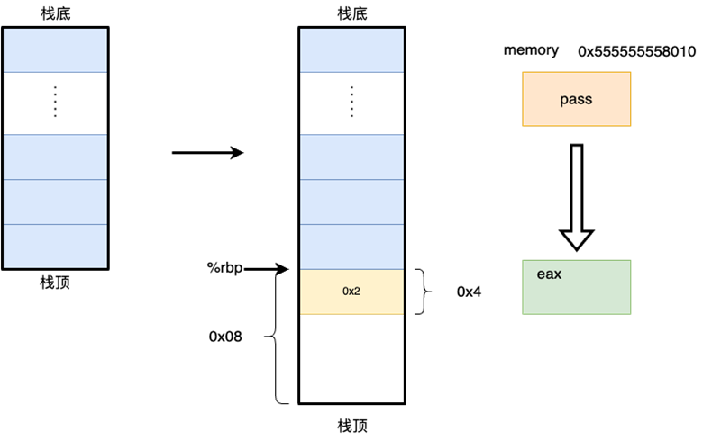

# XJTU-ICS LAB 2: Bomb Lab（拆弹实验）

## 实验简介

不知道大家学完第三章：*Machine-Level Representation of Programs*（中文版章节名：程序的机器级表示）之后，回看大一学习的C/C++中的知识与概念，**是否有新的领悟，甚至感到醍醐灌顶呢**？什么？完全没有？没关系，纸上得来终觉浅，绝知此事要躬行。这次实验就让我们来亲自动手实操一下，感受C语言或者说是计算机程序到底都是如何在计算机底层进行构造并运行的。

在这个实验中，同学们需要通过逆向程序或者debugger等方法**拆除一颗已经编写好的可执行"炸弹"**，你将不会获得程序源码，而仅仅拥有一份可以运行的二进制文件，通过观察/调试这份可执行文件来化解这颗 **"炸弹"**。**拆弹**的过程将会很有挑战，但是在动手解决问题的过程中，在逐步领会一些计算机底层概念的同时，你会逐渐惊叹于前人设计程序机器级运行原理的奇思妙想，而这恰恰是计算机系统学习的有趣之处~

实验可能**颇具难度**，但是顺利学懂完成实验后，你将会加深诸如gdb等debugger的使用以及对x86-64汇编语言的理解, 同时期末考试可能也会让大家现场拆除一颗**简单的小炸弹**。💣 

废话不多说，请大家做好准备，真正有趣的地方才刚刚开始。

Enjoy and Have fun! 😍

## 注意事项

- 这是一个 **个人** 作业，每个同学的"炸弹"是从一系列各不相同的随机问题的组合而来的，并且即使问题相同，你们的具体拆弹密码也经过了来自于你学号的加密与随机。（所以其实问题的设立从本质上杜绝了抄袭，来自TA的微笑（x）。但还是要提醒大家不要抄袭或者任何学术不端的行为）
- 本次实验相比第一次实验**难度提升不少**，Please **Start Early** and **Ask more**.
- 文中任何linux有关命令输入示例都以如下形式进行表达，其中`linux$`为命令行标识符，表示处于**linux环境**下，后续为命令输入。

```bash
linux$ xxx
```

- 你可以采用**stdin输入**或者**文件输入**的方式分别进行拆弹。注意，以文件形式传入的密码时，为保险起见，请在当前文件最后一行密码最后输入的后面加上换行，即比如如下是你的密码文件：

```text
xxx xxx xxxx
....
1223 222 231231
```

请在最后一行后面添加换行，你的密码文件可能需要是如下形式

```none
1223 222 231231
（空行）
```

否则炸弹**可能**会把EOF（文件结束符号）作为你的密码，而将你误伤。💣

## 开发环境准备

前置要求：学习完[lab0](./lab0.md)，**不要尝试在windows下完成实验**。

Linux is All You Need

### 远程开发

我们在两台ICS服务器上均已经准备好了炸弹：

- 第一台服务器，放置于创新港，域名`x86.ics.xjtu-ants.net`，端口2291
- 第二台服务器，放置于兴庆，域名`x86-xq.ics.xjtu-ants.net`，端口2291

同学们可以选择登陆任意一台服务器，我们在两台服务器上均安置了**一模一样**的炸弹 💣

### 本地开发

由于本次实验，每位同学的炸弹内容**均不相同**，因此本地开发的同学请**私聊助教，并同时附上自己的学号**，助教会根据学号将炸弹分发给你，具体是一个`bomblab-number.tar`文件，其中`number`是自己的学号。

## "拆弹"预备知识


C语言程序，会经过编译器的编译，编译器以汇编代码的方式产生输出，而汇编代码就是我们的机器代码的文本表示，然后通过链接步骤，生成可执行文件，可以被加载到内存被执行，更加细致完整的内容将在第七章中学习。

这个实验中我们主要关心：**程序的汇编代码构造机理**，也就是说，完成这个实验仅需要关注汇编语言（x86-64汇编）的部分。

## 了解"拆弹"工具

有关GDB的相关资料，用于快速上手：

- [Simple Use of GDB](../assets/files/gdb.pdf)
- [GDB excerpt](https://cs61c.org/sp25/labs/lab02/#what-is-gdb)
- [GDB documentation](https://sourceware.org/gdb/current/onlinedocs/gdb.html/)

X86-64指令相关的简单文档：[x86-64-reference.pdf](../assets/files/x86-64-reference.pdf)

!!!note
    实验中同学们可能还会遇到一些没有见过的指令，这里不详细展开了，聪明的你借助大模型和google一定可以快速得到资料～

## "拆弹"准备

在你看到这句话的时候，TA就已经在你的ICSServer用户主目录下安放好了炸弹。查看这颗炸弹的方式如下：

### 登录

首先登录ICSServer，可以选择两台中的任意一台进行登陆

### 进入主目录

进入你的**用户主目录**（一般来说，在你登录后就默认处于你的用户主目录下，用户主目录即`/home/username`，比如对用户`2183311128-ics`来说，`/home/2183311128-ics`就是他的用户主目录）

你可以通过如下两种方式从任意目录进入你的用户主目录。

```bash
linux$ cd
```

```bash
linux$ cd ~
```

### 检查炸弹的完整性

在主目录下执行ls

```bash
linux$ ls
... bomblab-number ...
```

你可以看到一个`bomb-number`目录，这就是你的炸弹目录，其中number是**你个人的学号**。

!!!warning
    请仔细检查炸弹学号和自己的学号是否匹配，以防误拿别的同学的炸弹～

!!!warning
    本次实验**每个同学的炸弹均不相同**，使用本地开发, 炸弹遗失或者炸弹出现错误的同学**请联系助教**处理

进入炸弹目录

```bash
linux$ cd bomb-number
```

检查炸弹完整性，正常来说你会看到如下的目录：

```bash
linux$ ls
bomb  bomb.c ID
```

- `bomb`: 本次实验所要拆除的炸弹，请一定保证**这个文件存在**
- `bomb.c`: 炸弹的大致结构
- `ID`: 内部包含了每个同学的学号，请**仔细比对是否和自己的学号有出入**
- `Makefile`: 包含了测试和提交的命令

!!!warning
    如果本地目录下没有炸弹，或者炸弹不完整请及时联系助教解决。

检查完毕，可以开始尝试**拆弹**。

## 尝试"拆弹"

### 炸弹结构简介

我们在`bomb.c`中为大家以代码的形式，简单介绍了一下炸弹的整体结构：

请注意这个代码本身其实并**不可以编译**，他只是作为介绍`bomb`结构的介绍文件的方式存在。真实的`bomb`以`bomb.c`为框架生成`bomb`。

```c
/*
 * Note to self: Remember to erase this file so my victims will have no
 * idea what is going on, and so they will all blow up in a
 * spectaculary fiendish explosion. -- Dr. Evil
 */

FILE *infile;

int main(int argc, char *argv[])
{
    char *input;

    .......
    .......

    /* Hmm...  Six phases must be more secure than one phase! */
    input = read_line();             /* Get input                   */
    phase_1(input);                  /* Run the phase               */
    phase_defused();                 /* Drat!  They figured it out!
                      * Let me know how they did it. */
      .....
    input = read_line();
    phase_2(input);
    .....
    .....
    input = read_line();
    phase_6(input);
```

本质上我们的拆弹分成6个阶段，这六个阶段**每个阶段都需要我们键入特定的密码内容来拆弹**，而这个密码推荐以一个**输入文件**的方式来传递。并且处理每一个炸弹都通过**阅读输入文件的完整一行**（`read_line()`）的方式来传递。

我们将`bomb.c`分发给了大家，大家可以通过阅读了解炸弹大致结构。

!!!danger
    炸弹的拆除是**按阶段进行**的，也就是说你**必须在通过phase_1之后才能继续phase_2**，否则即使后面的炸弹全部正确拆除，最终得分仍然是0分。

### 尝试拆弹

一个比较推荐的拆弹流程如下：

#### 创建求解密码文件

我们在`bomb`路径下创建一个文件，作为后续的炸弹的求解输入文件：

```bash
# 进入bomb目录
linux$ cd bomb-number
# 创建solution文件
linux$ touch solution.txt
```

!!!note
    炸弹的求解文件统一命名为`solution.txt` 

这个文件可以作为后续你的求解问题的输入。你可以通过编辑器，比如`VSCode Remote/Vim`来进行密码文件（`solution.txt`）的修改。`solution.txt`应该具有以下的典型结构：

```none
xxx xxx xxx   // phase_1的解
xxxxxxxx      // phase_2的解
xxxxxx xxxxx  // phase_3的解
....
```

#### 尝试"引爆炸弹"

使用以下命令运行一下**炸弹**。

```bash
linux$ ./bomb < solution.txt
```

或者你也可以运行`make grade`:

```bash
linux$ make grade
```

空文件运行的典型结果如下：

```bash
linux$ ./bomb < solution.txt
Welcome to my fiendish little bomb. You have 6 phases with
which to blow yourself up. Have a nice day!
Error: Premature EOF on stdin
```

他的含义是，在尝试求解某一个炸弹问题的时候，他读取到的`EOF`（`End Of File`）。

之后出现类似的报错，说明你拆弹的文件在某一个阶段的时候他的输入为空。

#### 尝试拆除炸弹

你可以在求解文件中尝试输入一些密码信息。

如果你的输入密码在某个阶段信息不正确，则典型的运行结果如下：

```bash
linux$ ./bomb < solution.txt
Welcome to my fiendish little bomb. You have 6 phases with
which to blow yourself up. Have a nice day!
phase_1 defused! Congrates!
The score you've got now is:
(10/100)
phase_2 defused! Congrates!
The score you've got now is:
(25/100)

BOOM!!!
The bomb has blown up in phase 3.

The total score you've had is:
(25/100)
```

如上运行结果表明，`Phase 1` 炸弹拆除，`Phase 2`炸弹拆除，但是在`Phase 3`不幸的是，炸弹爆炸啦！说明你的`phase 3`拆除密码存在着一些问题。

OK，如果出现以上类似结果，**说明你的炸弹确实会爆炸，你可以放心大胆地开始你的拆弹之旅~**

## "拆弹"经验分享

人总是会对未知的事物产生恐惧，特别当他还是一个"炸弹"的时候。为了帮助大家缓解这种恐惧并可以有头绪地拆除炸弹，在这里通过一个简单的例子，介绍逆向程序行之有效的方法。

大致拆弹路径遵循以下两步：

- 从可执行文件生成一个**汇编代码文件**，从汇编入手分析函数大致功能，汇编的生成有以下两种方法：

    - objdump生成完整汇编文件，（注意本实验内objdump生成的汇编文件地址为**相对地址**，并非最后可以用于寻址的虚拟地址）
    - 在gdb中通过`disas`指令生成当前section的汇编，这里生成的汇编地址准确，但是观察更加复杂

- 通过GDB观察运行时内存、寄存器参数值等获得拆弹密码值。

    - GDB单步运行，查看具体运行过程与内存、寄存器值，得到各个阶段密码。

### 一个简单的例子

```c
#include <stdio.h>

int pass = 1;

void add(int* x)
{
  ++*x;
}

int main(){
  int input = 2;
  add(&pass);
  if (pass != input)
  {
    printf("Something Wrong");
    return 0;
  }
  printf("Everything good!\n");
  return 0;
}
```

#### 生成可执行文件

```bash
linux$ gcc test.c -o test
```

程序虽小，五脏俱全（全局变量，局部变量，string常量，函数调用，指针参数传递....）

我们可以把小程序当做一个小炸弹，变量`input`就是我们尝试键入的解密密码，而`pass`变量就是解密炸弹的密码，我们通过比对输入和密码来确定炸弹是否被成功拆除。所以我们现在从这个例子入手，去介绍一下怎么从可执行文件来反推函数功能，从而确定输入以拆除炸弹。

### 反汇编工具

#### 从可执行程序生成汇编代码

使用之前介绍过的工具：objdump来生成test的汇编代码。

```bash
linux$ objdump -d test > test.s
```

此时将会在对应目录下生成一个test.s文件

```bash
linux$ ls
... test.s ....
```

这个文件内容包含了完整的所有汇编代码。同理我们也可以使用`objdump`去生成`bomb`的汇编代码文件。

得到`test`汇编代码中的部分如下：

```asm
0000000000001187 <main>:
    1187: f3 0f 1e fa           endbr64
    118b: 55                    push   %rbp
    118c: 48 89 e5              mov    %rsp,%rbp
    118f: 48 83 ec 10           sub    $0x10,%rsp
    1193: c7 45 fc 02 00 00 00  movl   $0x2,-0x4(%rbp)
    119a: 48 8d 05 6f 2e 00 00  lea    0x2e6f(%rip),%rax        # 4010 <pass>
    11a1: 48 89 c7              mov    %rax,%rdi
    11a4: e8 c0 ff ff ff        call   1169 <add>
    11a9: 8b 05 61 2e 00 00     mov    0x2e61(%rip),%eax        # 4010 <pass>
    11af: 39 45 fc              cmp    %eax,-0x4(%rbp)
    11b2: 74 1b                 je     11cf <main+0x48>
    11b4: 48 8d 05 49 0e 00 00  lea    0xe49(%rip),%rax        # 2004 <_IO_stdin_used+0x4>
    11bb: 48 89 c7              mov    %rax,%rdi
    11be: b8 00 00 00 00        mov    $0x0,%eax
    11c3: e8 a8 fe ff ff        call   1070 <printf@plt>
    11c8: b8 00 00 00 00        mov    $0x0,%eax
    11cd: eb 14                 jmp    11e3 <main+0x5c>
    11cf: 48 8d 05 3e 0e 00 00  lea    0xe3e(%rip),%rax        # 2014 <_IO_stdin_used+0x14>
    11d6: 48 89 c7              mov    %rax,%rdi
    11d9: e8 82 fe ff ff        call   1060 <puts@plt>
    11de: b8 00 00 00 00        mov    $0x0,%eax
    11e3: c9                    leave
    11e4: c3                    ret

    ...
    0000000000001169 <add>:
    1169: f3 0f 1e fa           endbr64
    116d: 55                    push   %rbp
    116e: 48 89 e5              mov    %rsp,%rbp
    1171: 48 89 7d f8           mov    %rdi,-0x8(%rbp)
    1175: 48 8b 45 f8           mov    -0x8(%rbp),%rax
    1179: 8b 00                 mov    (%rax),%eax
    117b: 8d 50 01              lea    0x1(%rax),%edx
    117e: 48 8b 45 f8           mov    -0x8(%rbp),%rax
    1182: 89 10                 mov    %edx,(%rax)
    1184: 90                    nop
    1185: 5d                    pop    %rbp
    1186: c3                    ret
```

在`gdb`中直接看所有完整的汇编代码并不方便，所以使用`objdump`生成汇编代码作为汇编**参照**。

**注意，在拆弹实验中，`objdump`生成的汇编地址并非最后的内存虚拟地址，而是一个相对地址。** `objdump`生成的绝对地址有问题，但是各个指令之间的相对位置不会出现改变，**可以认为在可执行程序加载到内存的时候，操作系统帮我们完成一次地址移动，绝对地址改变，但是指令之间的相对地址关系不变。**

### `GDB`(`Debugger`)

直接肉眼阅读、人脑模拟机器代码的执行可能还是过于困难。所以我们仅仅只是建议将反汇编工具`objdump`获取的汇编代码用于参照和初步确定程序功能。真正的拆除炸弹的过程交给`GDB`（`Debugger`）来完成。

#### `GDB`装载可执行文件

```bash
linux$ gdb test
GNU gdb (Ubuntu 12.1-0ubuntu1~22.04) 12.1
Copyright (C) 2022 Free Software Foundation, Inc.
License GPLv3+: GNU GPL version 3 or later <http://gnu.org/licenses/gpl.html>
This is free software: you are free to change and redistribute it.
There is NO WARRANTY, to the extent permitted by law.
Type "show copying" and "show warranty" for details.
This GDB was configured as "x86_64-linux-gnu".
Type "show configuration" for configuration details.
For bug reporting instructions, please see:
<https://www.gnu.org/software/gdb/bugs/>.
Find the GDB manual and other documentation resources online at:
    <http://www.gnu.org/software/gdb/documentation/>.

For help, type "help".
Type "apropos word" to search for commands related to "word"...
Reading symbols from test...
(No debugging symbols found in test)
(gdb)
```

#### 入口函数断点并开始运行

```bash
(gdb) b main
Breakpoint 1 at 0x118f
(gdb) run
Starting program: /home/slyang/xjtu-ics/lab2/test
[Thread debugging using libthread_db enabled]
Using host libthread_db library "/lib/x86_64-linux-gnu/libthread_db.so.1".

Breakpoint 1, 0x000055555555518f in main ()
```

当前程序暂停在了`main`函数入口。

**注意，如果需要在`gdb`运行时输入文件，请以如下形式来使用`gdb`：**

```bash
linux$ gdb bomb
.....
(gdb) run < solution.txt
.....
```

#### 分析`main`函数行为

##### 移动栈顶指针

```bash
(gdb) x /i $rip
=> 0x55555555518f <main+8>:  sub    $0x10,%rsp
```

当前运行的指令如上，完成栈指针的移动，栈顶向下生长0x10个字节，即16字节。


之后采用单步执行的方法逐步运行函数：

```bash
(gdb) ni
0x0000555555555193 in main ()
```

##### 压入临时变量

原有指令，将rsp栈指针寄存器赋给了rbp寄存器。

```asm
0x000055555555518c <+5>:  mov    %rsp,%rbp
```

因此对应汇编指令：

```asm
0x0000555555555193 <+12>:  movl   $0x2,-0x4(%rbp)
```

因此`-0x4(%rbp)`等于原有栈顶下0x4的位置，因此就是在原有栈顶之后压入一个四字节的0x2


##### 传递参数调用过程


调用者保佑寄存器图


被调用者保佑寄存器图

在x86-64 Linux ABI（Apllication Binary Interface）中的Function Calling Sequence（函数调用约定）规定了函数调用和参数传递的相关规则（即在rdi寄存器保存第一个参数、rsi寄存器保存第二个参数，哪些寄存器属于被调用者使用等等），大家可以在书本对应位置查找到使用方法，这里不再做赘述。

根据函数调用约定，我们知道rdi寄存器内保存着函数调用的第一个参数。

```asm
0x000055555555519a <+19>:  lea    0x2e6f(%rip),%rax        # 0x555555558010 <pass>
0x00005555555551a1 <+26>:  mov    %rax,%rdi
0x00005555555551a4 <+29>:  call   0x555555555169 <add>
```

将`0x2e6f(%rip)`传递给$rdi寄存器，rdi寄存器内保存函数调用的第一个参数，我们可以通过gdb来查看对应的值到底是多少：

```bash
0x00005555555551a4 in main ()
(gdb) p /x $rdi
$2 = 0x555555558010
```

因此上述指令，将`0x555555558010`作为第一个参数传递给`add`函数，并调用`add`函数继续执行。

#### 分析`add`函数执行

##### 保存程序现场并移动栈顶

```asm
0000000000001169 <add>:
    1169: f3 0f 1e fa           endbr64
    116d: 55                    push   %rbp
    116e: 48 89 e5              mov    %rsp,%rbp
```


##### 保存参数值

```asm
1171: 48 89 7d f8           mov    %rdi,-0x8(%rbp)
1175: 48 8b 45 f8           mov    -0x8(%rbp),%rax
1179: 8b 00                 mov    (%rax),%eax
```

其实只是将`rdi`指向的区域上的内容保存在了`$eax`寄存器中。**这个`-0x8(%rbp)`地址只是作为`add`函数输入参数的暂存地址。**

##### 完成`++`操作并赋值

```asm
117b: 8d 50 01              lea    0x1(%rax),%edx      # 值 + 1
117e: 48 8b 45 f8           mov    -0x8(%rbp),%rax    # 取得参数地址
1182: 89 10                 mov    %edx,(%rax)        # 将值写回对应的参数
1184: 90                    nop                        # 什么都不干
```

首先通过`lea`指令进行` ++` ，然后将原有参数地址写回。

##### 恢复现场

```asm
1185: 5d                    pop    %rbp
1186: c3                    ret
```


恢复现场，返回`main`函数继续执行。

#### 分析`main`函数剩余操作

##### 比较参数

```asm
0x00005555555551a9 <+34>:  mov    0x2e61(%rip),%eax        # 0x555555558010 <pass> 将pass的值保存在eax寄存器中
0x00005555555551af <+40>:  cmp    %eax,-0x4(%rbp)          # 比较pass和input 0x2
```

比较`input`（`0x2`）和`pass`的值



##### 相等则跳转

```asm
0x00005555555551b2 <+43>:  je     0x5555555551cf <main+72>
  ....
  0x00005555555551cf <+72>:  lea    0xe3e(%rip),%rax        # 0x555555556014
0x00005555555551d6 <+79>:  mov    %rax,%rdi
0x00005555555551d9 <+82>:  call   0x555555555060 <puts@plt>
0x00005555555551de <+87>:  mov    $0x0,%eax
```

如果比较结果相等，就把对应的`0x555555556014`地址放置在rdi寄存器中作为第一个参数传递给`printf`，我们通过查询可以知道`printf`的接口如下（或者可以通过在Linux Shell中输入`man printf `来查询`printf`接口参数）

```bash
printf FORMAT [ARGUMENT]...
```

第一个传入的参数，是`string`类型，则通过`gdb`查询相关地址的`string`值。

```bash
(gdb) x /s 0x555555556014
0x555555556014:  "Everything good!"
# x 查询地址 /s (输出string 类型) 0x555555556014（查询地址）
```

从输出的结果中，我们知道，正常执行的是“等于”的情况，并且比较的密码是`0x2`.

所以应该输入的密码就是`0x2`。

## Some Hint

上面我们用一个很简单的例子来展示了一下怎么使用`gdb/objdump`等工具进行分析函数运行过程，以获取整体程序关键。篇幅有限写的比较简略，具体内容请大家结合书本3.6 3.7节内容进行分析。

真实的“`bomb`”程序会相对更复杂一些，为了大家可以更有头绪的开展实验，我们在这一小节中进行简要的提示，就像电影中所有自以为是的恐怖分子一样，总还是希望拆弹专家们可以和他周旋周旋，不要一下都被炸死了（x。

### 解题方法

一些可能有效解题方法。

#### 按照`phase`进行拆弹

我们的炸弹（`bomb`）是按照`phase`进行逐级比对， **并且每个`phase`被独立组织成了一个函数** ，所以在汇编中查找`phase`标号，并有规划按照`phase`为单位进行求解或许将会使得你拆弹过程有条不紊。

```asm
0x.... <phase_1>:
    ....
    ....
    ....
    ....

0x.... <phase_2>:
    ....
    ....
    ....
```

#### 关注`explode_bomb`标号

关键密码比对逻辑后面紧跟着就是失败的爆炸函数（`explode_bomb`）调用，**所以请关注`explode_bomb`标号他可能可以帮助你快速定位拆弹关键逻辑。**

#### 关注栈指针操作

栈是`C`程序关键的运行资源，很多临时变量、地址等参数都会存放在栈上。理解栈操作对理解程序行为极其关键。

函数开头的一些栈指针操作，其实可能是在保存上一个函数的现场，或者进行栈保护检测。我们需要关注的是，很多临时变量的在栈中的位置和作用。 **栈中的一些值，通常对应了函数中的一些临时变量。** 理解这个内容并好好利用将会帮助你理解程序行为。

#### 关注`ABI`与函数`API`的对应关系

`ABI`中包含了机器码中进行传输参数的寄存器规范：`rdi`保存传递的第一个参数，`rsi`保存传递的第二个参数......。**我们关注其和真实函数的`API`的对应关系，** 比如在如上例子中，我们通过查询`printf`第一个参数的类型（`string`类型）知道了rdi寄存器下保存的关键信息的类型。并通过查询这个关键参数的方式求解出了关键信息。

`bomb`实验中频繁用到了`sscanf`函数，我们使用它来接收密码文件的输入参数，通过确定他的格式`format`，可以帮助大家快速确定输入密码的个数。通过理解此函数的`API`与`ABI`对应关系，对求解出`bomb`问题会有巨大帮助。

### 各个`phase`的构造结构

通过观察`bomb.c`内容，我们可以知道`bomb`的整体构造结构，为了大家可以更有思路的去完成实验，我们简单介绍一下各个`phase`的主要结构。希望大家在求解过程中可以更有方向去进行。

#### `phase_1`：

简单的字符串比对

#### `phase_2`：

请关注输入数字中后一个和前一个的关系

#### `phase_3`：

```c
Switch ()
    case:
    ...
  case:
    ...
```

#### `phase_4`：

递归

#### `phase_5`：

请关注你的输入和`array`的转换关系

#### `phase_6`：

链表

#### `secret_phase`

本实验除了这6个`phase`外，甚至还有一个隐藏关卡，大家有兴趣有能力的话可以去试试找到并解决，**隐藏关卡不算入总分**。

!!!note
    不同的phase难度原则上是**递增**的，但是大家可能对于不同的代码结构模式理解能力不同，因此难度对大家来说并不存在线性关系～。

## 评分方法与代码提交

### 评分方法

各个`phase`占比如下：

- `phase1`：10分
- `phase2`：15分
- `phase3`: 20分
- `phase4`：30分
- `phase5`: 15分
- `phase6`: 10分
- `Secret_phase`: 不占分

你将在你的运行结果后实时获得你的分数

切换到你的实验目录，使用下列两种命令的其中一种运行炸弹：

```bash
linux$ ./bomb < solution.txt
```

```bash
linux$ make grade
```

一个典型的运行结果如下：

成功解决每个`phase`后，你将实时得到你当前的分数。

```none
linux$ ./bomb < solution.txt
Welcome to my fiendish little bomb. You have 6 phases with
which to blow yourself up. Have a nice day!
phase_1 defused! Congrates!
The score you've got now is:
(10/100)
phase_2 defused! Congrates!
The score you've got now is:
(25/100)
phase_3 defused! Congrates!
The score you've got now is:
(45/100)
phase_4 defused! Congrates!
The score you've got now is:
(75/100)
phase_5 defused! Congrates!
The score you've got now is:
(90/100)
phase_6 defused! Congrates!
The score you've got now is:
(100/100)
Congratulations! You've defused the bomb!
(100/100)
```

### 迟交
在超过原定的截止时间后，我们仍然接受同学的提交。此时，在lab中能获得的最高分数将随着迟交天数的增加而减少，具体服从以下给分策略：

超时7天（含7天）以内时，每天扣除3%的分数
超时7~14天（含14天）时，每天扣除4%的分数
超时14天以上时，每天扣除7%的分数，直至扣完
以上策略中超时不足一天的，均按一天计，自ddl时间开始计算。届时在线学习平台将开放迟交通道。

评分样例：如某同学小H在lab中取得95分，但晚交3天，那么他的最终分数就为`95*(1-3*3%)=86.45`分。同样的分数在晚交8天时，最终分数则为`95*(1-7*3%-1*4%)=71.25`分。

### 提交

在你的实验目录下，运行下列命令：

```bash
make submit
```

这会将你的炸弹解密文件`solution.txt`与炸弹`bomb`可执行文件放在一个文件夹下，然后把该文件夹压缩，压缩格式为`zip`，命名格式为：`学号-handin.zip`，当然你也可以手动进行压缩打包。打包完成之后将`.zip`文件提交至[在线学习平台](http://class.xjtu.edu.cn/)上的作业模块中。

## 写在最后

爬坡的时候是你提升最大的时候，请不要轻言放弃！💪

希望大家玩的开心~

---

Copyright © 2025 XJTU ICS-TEAM
