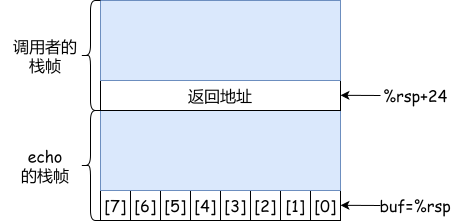
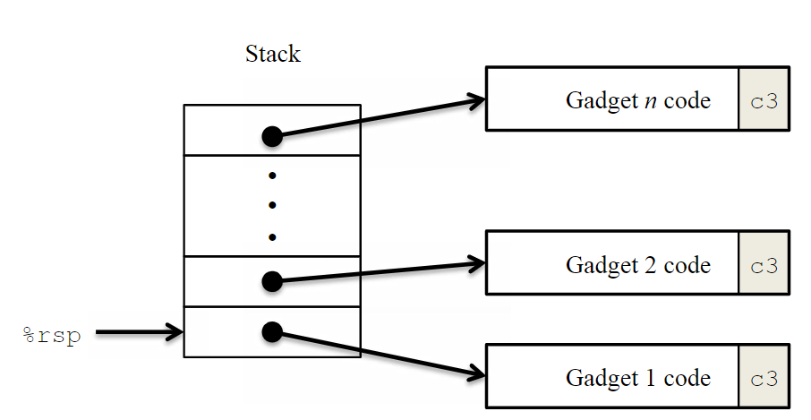
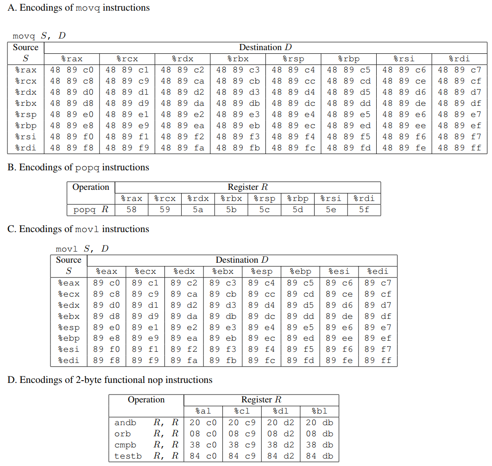
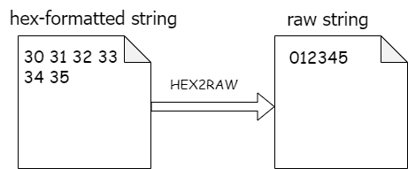

# XJTU-ICS LAB 3: Attack Lab

## 实验简介

嘿嘿，一转眼就到了第三个实验了呢。不知道大家在经历了第二个实验——bomblab之后有没有加深对gdb和x86汇编的理解呢，是被"炸弹"炸的神志不清，还是已经成为拆弹高手了呢？不管大家与炸弹周旋的怎么样，本次实验将提供另一个崭新的舞台——利用**缓冲区溢出**来进行模拟攻击目标程序，满足同学们从小的当黑客的愿望～。

本实验将通过分析和攻击两个包含不同安全漏洞的程序（`ctarget`和`rtarget`）来增进你对程序安全性的理解。通过本实验，你将可以：

- 理解缓冲区溢出漏洞及其对程序安全性的影响，以及黑客如何利用这类漏洞执行恶意操作。
- 学习如何通过合理的编程和利用编译器以及操作系统提供的安全机制，增强自己编写的程序的安全性。
- 深入了解函数调用过程中的栈管理机制以及参数在函数之间传递的方式。
- 学会使用`gcc`工具生成用于漏洞攻击的字节序列，了解`x86-64`架构下的指令编码方法。
- 提升对`objdump`、`gdb`等工具的熟练度，这些工具对于程序分析和调试至关重要。

实验可能**颇具难度**，但是相信同学们在完成实验之后一定可以对x86汇编，尤其是函数调用和缓冲区溢出导致的安全问题

!!!note
    1. 通过本实验，你将学习到利用安全性漏洞攻击操作系统和网络服务器的方法。本实验的目的是通过模拟攻击来增进对安全漏洞的理解和防范意识，了解安全漏洞的本质。本实验内容应仅用于学习目的，严禁用于任何非法或不道德的活动。
    2. 本实验开始前，需要学习CS:APP3e第3.10.3节和第3.10.4节的知识。

Good luck and have fun! 😍

## 注意事项

- 这是一个 **个人** 作业，不要尝试组队完成。

- 每个学生的题目都是**独立且随机**的，请遵循学术诚信原则，不要抄袭或参与任何不诚实的行为。

- 你需要将解题的答案写在`phase1~5.txt`5个文件中，文件命名请一定保证规范。并且可以通过`autograder.py`计算自己的得分。

- 你在进行`attack`实验时不可以使用攻击跳过程序中的一些有效代码。具体来说，你在攻击时使用的字符串中嵌入的**用于`ret`指令跳转的地址**都应指向以下三个地址之一：

    - 函数`touch1`、 `touch2` 或`touch3` 的地址。
    - 你自己注入的代码的地址。
    - `gadget farm`中某个`gadget`的地址。

- 你只能从文件`rtarget`中的函数`start_farm`和`end_farm`之间的地址去构造你的`gadget`。

- 实验难度不小，**Please start early** and **ask more**

第一次阅读本文档时，可能觉着这些注意事项有些摸不着头脑，后续还会有对这些规则的详细说明。

## 开发环境准备

前置要求：学习完[lab0](./lab0.md)，**不要尝试在windows环境下完成实验**

Linux is all you need.

!!!warning
    本次实验对编译器和标准库版本有强烈依赖，因此**强烈建议**所有同学在ics服务器上完成实验，本地开发可能会遇到各种各样的环境问题。

## 实验前置知识

这个小节仅对CS:APP3e第3.10.3节简单介绍一下，并不全面，如果对缓冲区溢出的知识比较熟悉可以略过此节。如果想了解更多请自学课本3.10.3节中的内容。

C语言对于数组引用并不进行任何边界检查，而且局部变量和状态信息都存放在栈中。这两种情况结合到一起就会导致严重的程序错误，对越界的数组元素的写操作会破坏存储在栈中的状态信息。当程序使用这个被破坏的状态，试图重新加载寄存器或执行`ret`指令时，就会出现很严重的错误。

例如**缓冲区溢出（buffer overflow）**，如果程序在栈中分配某个字符数组来保存一个字符串，但是字符串的长度超出了为数组分配的空间。

例如有一个`echo`函数的代码如下：

```c
/* Read input line and write it back */
void echo() {
    char buf[8];
    gets(buf);
    puts(buf);
}
```

在调用`echo`函数时，我们可以通过程序的汇编语言得知栈的组织基本如下图所示：



图中`echo`程序在栈中为自己分配了24字节的地址空间（`echo`的栈帧），字符数组`buf`位于栈顶，可以看到，`buf`之外`echo`还分配了`16`字节是未被使用的。此时只要用户输入不超过`7`个字符，`gets`返回的字符串就可以放进`buf`的空间中，不过，长一些的字符串就会导致`gets`覆盖栈上存储的某些信息，随着字符串变长，下面的信息就会被破坏。

| 输入的字符数量| 附加的被破坏的状态|
|-|-|
|`0~7`| 无|
|`9~23`|未被使用的栈空间|
|`24~31`|返回地址|
|`32+`|`caller`中保存的状态|

字符串在`23`个字符以前都没有特别严重的后果，但是超过`23`个字符会导致返回指针的值，以及更多的保存状态被破坏。

如果存储的返回地址的值被破坏了，那么`ret`指令会导致程序跳转到一个完全意想不到的位置。因此，黑客们可以精心设计输入字符串，使得目标程序执行自己设计的代码，从而产生十分恶劣的后果。

!!!note
    大名鼎鼎的蠕虫病毒，出自Robert Morris之手（如果你尝试自学计算机，那么我相信你也会对这个人名耳熟能详（笑））。其中一种攻击方法就是通过对finger进程进行缓冲区溢出攻击，让蠕虫程序访问远程系统然后进行自我复制，从而消耗大部分计算资源，并通过互联网进行大规模传播，导致机器大面积瘫痪。有兴趣的同学可以自己Google了解更多。

## 实验准备

首先登陆ICSserver，你可以选择任意一台服务器完成实验。

不出意外的话，在自己的家目录下面会存在一个名为`attacklab-<number>-<target>`的目录：

```bash
linux$ cd
linux$ ls
... attacklab-<number>-<target> ...
```

!!!warning
    如果你在任意一台服务器上缺少这个目录，请立刻联系助教寻求帮助

其中：

- number字段是你的学号，请**仔细检查学号是否和自己的真实学号匹配**

- target字段是你的学号生成的种子，用于确保每位同学学号的唯一性，这个字段与本次实验无关，**可以忽略**。为了满足同学的好奇心，种子的生成规则如下：

    - 最高位是一个1-4以内的随机数，代表用的是哪一套题目（是的，助教们为每位学生准备了四套不同的题目（笑））
    - 第2-3位是你自己的入学年份
    - 最后四位和学号的末四位相同

通过target字段，我们实现了每位同学的题目唯一性，从而杜绝抄袭 😊

题目可能拥有多种攻击方法，不过可以保证的是，发给每位同学的题**一定有一种可以达到满分的确定的攻击方法**

让我们进入正题，首先检查实验的完整性

```bash
linux$ cd attacklab-<number>-<target>
linux$ ls
README.txt  autograder.py  cookie.txt  ctarget  farm.c  hex2raw  lib  Makefile rtarget
```

!!!warning
    如果出现实验完整性的问题，请联系助教进行处理

目录下有这些文件，如下表所示：

| **文件名**   | **简介**                                                     |
| ------------ | ------------------------------------------------------------ |
| `README.txt` | 描述目录下各个文件的内容                                     |
| `ctarget`    | 易受到**代码注入攻击**（Code Injection Attacks）的可执行程序                             |
| `rtarget`    | 易受到**返回导向编程攻击**（Return-oriented Programming Attacks）的可执行程序                         |
| `cookie.txt` | 8位十六进制代码，每位同学的不同，在有些攻击中会用到。        |
| `farm.c`     | `gadget farm`的源代码，你将使用这些`gadget farm`来完成**返回导向编程攻击**。(后续会介绍`gadget farm`) |
| `hex2raw`    | 生成攻击字符串的文件（使用方法见附录A）                      |
| `autograder.py`| 计算分数的`python`脚本                      |
| `lib/`| `lib/`目录是`ctarget`和`rtarget`需要的依赖，你不需要修改其中的内容             |
| `Makefile` | 可以帮助你生成最终提交的文件`xxx-ics-handin.zip`|

!!!danger
    尝试运行一下./ctarget和./rtarget两个程序，正常情况会在终端显示一段提示语，然后等待你的输入。如果你出现任何权限问题，或者出现segmentation fault等，请联系助教进行处理。

## Target程序

### target程序简介

总的来说，你的任务是攻击两个程序，`ctarget`和`rtarget`， 这两个程序都从**标准输入（stdin）**读取字符串，所使用的函数`getbuf`定义如下：

```c
unsigned getbuf()
 {
     char buf[BUFFER_SIZE];
     Gets(buf);
     return 1;
 }
```

函数`Gets`类似于标准库函数中的`gets`函数，它从标准输入读取一个字符串(以"`\n`"或文件结束符结束)，并将其存储（连同一个空终止符）在指定的目的地。在此示例中，目的地是名为`buf`的数组，其大小由编译时常量`BUFFER_SIZE`定义。

函数`Gets()`和`gets()`没有约束输入字符串的长度，它们只是简单地复制字节序列，因此如果输入的字符串太长可能会超出原本分配的存储空间。例如，在这个程序中就可能会超出`buf`数组的长度，造成缓冲区溢出（`buffer overflow`）。

正常情况下，如果用户输入(即由`getbuf`读取)的字符串长度适中，`getbuf`将返回`1`，如下面的执行示例所示：

```bash
linux$  ./ctarget                                                                                                             
Cookie: 0x6f9798cf
Type string:123123
No exploit.  Getbuf returned 0x1
Normal return
```

如上，输入了字符串`123123`，运行结果是`Normal return`，可以正常执行。

如果用户输入的字符串过长，通常会出现段错误(`segmentation fault`)，这是因为你输入的字符串覆盖了栈中的有效信息。如下：

```bash
linux$ ./ctarget                                                                                                              
Cookie: 0x59b997fa
Type string:This is not a very interesting string, but it has the property ...
Ouch!: You caused a segmentation fault!
Better luck next time
FAIL
```

程序`rtarget`与`ctarget`的运行过程基本相同。

### 怎么攻击target？

正如错误信息所示，缓冲区溢出通常会导致程序状态被破坏或内存访问错误。你的任务是构造一个特殊的"字符串"，使得`ctarget`和`rtarget`不是简单的发生一个`segmentation fault`，而是按照我们提供一种"特殊字符串"的指引让`ctarget`和`rtarget`执行一些特定的操作。这些用于攻击的"特殊字符串"被称为**exploit字符串**。

`ctarget`和`rtarget`都提供了几个不同的命令行参数：

- `-h`: 打印帮助信息
- `-i FILE`: 从文件中输入，而不是从标准输入中输入

由于`ctarget`和`rtarget`这两个程序接收的是字符串输入，但是你在攻击中需要使用的“exploit字符串”的**有些字符可能不是ASCII字符集中对应的可打印的字符**。例如，一个字节的值是`0x31`，在ASCII中对应字符'`1`'，这是可以直接从键盘输入的；但是如果一个字节的值是`0x00`，我们通常没有直接对应的字符可以输入。

为了解决这个问题，我们提供了`hex2raw`工具。即使你需要一些无法输入的字符，`hex2raw`也可以生成对应字节的字符串，我们称为**原始字符串**（`raw string`），有关使用`hex2raw`的详细信息，以及如何利用原始字符串进行`gdb`调试，请阅读**附录A**（本文末尾）。

虽然说原始字符串可以作为`ctarget`和`rtarget`的直接输入，但是原始字符串的文件打开时通常是一堆乱码，不适合阅读和分析，所以`hex2raw`工具可以让你直接得到其每个字节的十六进制表示，因此你可以专注于构造一个字符串的十六进制表示，需要原始字符串时只需要使用`hex2raw`转换一下即可。

!!!note
    - 你在进行攻击时利用的exploit字符串在任何中间位置都不能包含字节值`0x0a`，因为这是换行（'`\n`'）的 `ASCII`码。当`Gets`遇到这个字节时，它会将其作为字符串的终止符。
    - 你可以使用一个或多个**用空格分隔的两位十六进制值**作为`hex2raw`的输入。因此，如果要创建一个十六进制值为`0`的字节，则需要将其写成`00`。例如要构造`0xdeadbeef`这个值，你应该向`hex2raw`输入"`ef be ad de`"（注意小端模式下的字节顺序需要反过来）。

如果你完成了一个十六进制表示的字符串的文件，例如文件`phase1.txt`，应该如下所示：

```assembly
/* phase1.txt */
00 00 00 00 00 00 00 00 
00 00 00 00 00 00 00 00 
/* some comments */
11 22 33 11 22 33 00 00
...
...
```

那么如何测试你的攻击是否成功呢？假设你在进行第一阶段实验的攻击时，你可以使用linux的管道命令，利用`hex2raw`生成`phase1.txt`的原始字节流，并将其作为`ctarget`的输入。

具体的`linux`命令如下，下面给出了一个典型的运行结果（如果你的`phase1.txt`是正确的）：

```bash                                
linux$ cat phase1.txt | ./hex2raw | ./ctarget        
Cookie: 0x59b997fa
Type string:Touch1!: You called touch1()
Valid solution for level 1 with target ctarget
PASS
```

!!!note
    上述命令的作用是，使用cat命令将phase1.txt输出，随后通过管道（|）将其传递给./hex2raw，这个程序将输出原始字节流，然后再次利用管道，将原始字节流倒入到程序./ctarget中。

| Phase | Program | Level | Method | Function | Points |
| ----- | ------- | ----- | ------ | -------- | ------ |
|   1   | CTARGET |   1   |   CI   |  touch1  |   10   |
|   2   | CTARGET |   2   |   CI   |  touch2  |   20   |
|   3   | CTARGET |   3   |   CI   |  touch3  |   30   |
|   4   | RTARGET |   2   |   ROP  |  touch2  |   30   |
|   5   | RTARGET |   3   |   ROP  |  touch3  |   10   |

上表总结了实验的五个阶段（`phase`）。可以看出，前三个阶段涉及对`ctarget`的代码注入（Code Injection, CI）攻击，后两个阶段涉及对`rtarget`的返回导向编程（Return-oriented Programming, ROP）攻击。

顺利完成前三个phase，也就是代码注入攻击之后，你将得到基本的60分。而最后两个phase较难，如果完成phase4，你将可以得到90分。最后的10分，供学有余力的同学登顶巅峰。

## 实验流程

本实验设计了5个阶段（phase 1 - phase 5)，前三个阶段你需要攻击`ctarget`，后两个阶段你需要攻击`rtarget`，`ctarget`和`rtarget`都以**原始字符串**作为输入，但是根据上文我们得知有些原始字符串是不容易直接输入的，为此我们需要先写出原始字符串对应的十六进制表示，例如上文中的`phase1.txt`，然后通过`hex2raw`程序来生成`phase1.txt`对应的原始字符串文件`raw1.txt`。

一个比较推荐的实验流程如下（以阶段1为例）：

- 首先，你需要在目录下新建一个文件`phase1.txt`（利用`vscode`左侧目录新建文件或者在终端使用`touch phase1.txt`都可以）。这个文件用来作为我们输入字符串的十六进制表示
- 然后，你可以尝试在`phase1.txt`中输入你的字符串的十六进制表示
- 接下来，你可以使用`hex2raw`生成原始字符串文件，例如下面的命令生成了一个原始字符串文件`raw1.txt`：

``` bash
linux$ ./hex2raw < phase1.txt > raw1.txt
```

- 然后你可以使用`gdb`来调试

```bash
linux$ gdb ctarget
```

- 在gdb调试时可以通过`run < raw1.txt`运行，进行调试：

```gdb
(gdb) run < raw1.txt
```

- 如何判断是否攻击成功呢？你可以将你生成的原始字符串文件作为`./ctarget`的输入，命令如下：

```bash
linux$ ./ctarget < raw1.txt         
Cookie: 0x59b997fa
Type string:Touch1!: You called touch1()
Valid solution for level 1 with target ctarget
PASS
```

如果得到类似的输出，那恭喜你，攻击成功！

!!!note
    你修改`phase1.txt`后需要要及时通过第2步的命令更新`raw1.txt`，否则运行`./ctarget < raw1.txt`得到的可能是旧的结果。

- 最后可以使用`autograder.py`测试你的得分。

```bash
linux$ python3 autograder.py
phase1 Score: 10 / 10
phase2 Score: 0 / 30
phase3 Score: 0 / 25
phase4 Score: 0 / 25
phase5 Score: 0 / 10
Total Score: 10 / 100 
```

!!!note
    `autograder.py`的工作流程是读取`phase1~5.txt`文件，并自动转化为原始字符串输入到对应的`ctarget` `rtarget`中，所以**注意如果你的文件名并不是`phase1~5.txt`，那运行`autograder.py`是没有分数的**。

## 第一部分：代码注入攻击（Code Injection Attacks）

在前三个阶段（`phase`），你将利用字符串攻击`ctarget`。该程序的堆栈位置在**每次运行时都是不变**的，因此堆栈上的数据可被视为可执行代码。这些特性使程序很容易受到攻击，因为你可以在你的攻击字符串中加入汇编指令的机器码。

### 阶段 1 (LEVEL 1)

在第1阶段，你不需要注入可执行代码。你需要构造**exploit字符串**，使得程序在getbuf之后不是返回到原有的流程，而是执行程序`touch1`。

函数`getbuf` 在 `ctarget` 中被函数`test`调用，其C语言代码如下：

```c
void test()
 {
     int val；
     val = getbuf()；
     printf("No exploit. Getbuf returned 0x%x\n", val)；
 }
```

当 `getbuf` 执行其返回语句（`getbuf` 的第 5 行）时，程序通常会在函数`test`中（该函数的第5行）继续执行。我们希望改变这种执行顺序。在文件`ctarget`中，有一个函数`touch1`的代码，其C语言表示如下：

```c
void touch1()
 {
     vlevel = 1;/* Part of validation protocol */
     printf("Touch1!You called touch1()\n")；
     validate(1);
     exit(0);
 }
```

在这个任务中，你需要构造一个特殊的输入字符串---**“exploit字符串”**，使得`ctarget`程序中的`getbuf`函数在执行其返回语句的时候不按照常规流程返回到test函数，而是跳转到`touch1`函数并执行其代码。请注意，你所构造的**exploit字符串**可能会对调用栈上`getbuf`函数之外的部分造成影响。但是，由于`touch1`函数的执行将导致程序立即退出，因此你不需要担心对栈的其他部分造成破坏。你的主要目标是确保能够成功调用`touch1`函数。

!!!tip
    - 使用`objdump -d ctarget`命令获取`ctarget`程序的反汇编代码。
    - 在反汇编代码中可以确定`touch1`函数的起始地址，并尝试使用这个地址覆盖`getbuf`的返回地址。注意在构造`exploit`字符串时，地址应该以字节形式表示，并且要注意字节的顺序（即小端顺序，使得低地址的字节在前）。
    - 利用`gdb`调试工具来检查`getbuf`函数执行的最后几条指令是否按照你的预期工作。
    - `buf`数组在`getbuf`函数的堆栈帧中的具体位置取决于`BUFFER_SIZE`的大小以及`gcc`的堆栈分配策略。你需要查看`ctarget`的反汇编代码来确定`buf`数组的准确位置，以便决定在**exploit字符串**的什么位置插入`touch1`的地址。

### 阶段 2 (LEVEL 2)

在第2阶段中，你的任务是将一小段可执行代码注入到**exploit字符串**中。这段代码将作为exploit字符串的一部分，并在攻击时执行`touch2`，`touch2`的参数是你的`cookie.txt`文件中的值。

在`ctarget` 文件中，有一个函数 `touch2`，其 C语言源代码如下：

```c
void touch2(unsigned val)
 {
     vlevel = 2; /* Part of validation protocol */
     if (val == cookie) {
         printf("Touch2!: You called touch2(0x%.8x)\n", val);
         validate(2);
     } else {
         printf("Misfire: You called touch2(0x%.8x)\n", val);
         fail(2);
     }
     exit(0);
 }
```

你的任务是让在`ctarget`程序中的`getbuf`函数在返回时不按照常规流程返回到`test`函数，而是跳转到`touch2`函数并执行其代码。关键在于，在运行`touch2`的时候，你需要将“`cookie`”值作为参数传递给它。这个“`cookie`”值对于每位同学都是唯一的，`touch2`函数需要接收到正确的“`cookie`”值才能攻击成功。

!!!tip
    - 你将要注入一段可执行代码到内存中，因此你需要思考如何放置这段可执行代码，并获得这段可执行代码的地址，从而使得`getbuf`代码末尾的`ret`指令可以跳转到你注入的可执行代码的地址。
    - 根据`x86-64`的调用约定，函数的第一个参数是通过`%rdi`寄存器传递的。因此，你注入的可执行代码应该包括**设置`%rdi`寄存器为你的“cookie”值的指令**。
    - 你的注入代码应该以一个`ret`指令结束，这将使得程序可以跳转到`touch2`函数的开始。
    - 不要尝试在你的**exploit代码**中使用`jmp`或`call`指令（理由是构建这些指令的目的地址的编码可能会比较复杂），所有跳转都要使用`ret`指令实现。
    - 如何知道汇编代码对应的字节序列？你可以参考**附录B**，了解如何使用`gcc`工具来将汇编代码转换成字节表示形式。

!!!note
    - 你在`gdb`调试时，当运行到你自己注入的代码时，可能会出现`gdb`找不到调用栈的情况，在`gdb`中表现为`??`，这属于正常现象，你可以根据指令的地址以及寄存器的值来判断你注入的代码是否正常运行。

### 阶段 3 (LEVEL 3)

第3个阶段也是代码注入攻击，与阶段2类似，攻击时需要使程序执行`touch3`，但是`touch3`需要一个**字符串**作为其参数。

在`ctarget`文件中，有函数`hexmatch`和`touch3`的代码，其`C`语言源代码如下：

```c
/* Compare string to hex represention of unsigned value */
int hexmatch(unsigned val, char *sval)
{
		char cbuf[110];
		/* Make position of check string unpredictable */
		char *s = cbuf + random() % 100;
		sprintf(s, "%.8x", val);
		return strncmp(sval, s, 9) == 0;
}
 
void touch3(char *sval)
{
    vlevel = 3; /* Part of validation protocol */
    if (hexmatch(cookie, sval)) {
        printf("Touch3!: You called touch3(\"%s\")\n", sval);
        validate(3);
    } else {
        printf("Misfire: You called touch3(\"%s\")\n", sval);
        fail(3);
    }
    exit(0);
}
```

你的任务是让`ctarget`程序中的`getbuf`函数在返回时不按照常规流程返回到`test`函数，而是跳转到`touch3`函数并执行其代码。关键在于，在运行`touch3`的时候，你需要将**以字符串形式表示的“`cookie`”值**作为参数传递给它。`touch3`函数需要接收到正确的“`cookie`”值的字符串才能攻击成功。

!!!tip
    - 你在攻击时利用的exploit字符串中需要包含`cookie`的字符串表示形式。该字符串应包含8个十六进制数字字符（从最高有效位到最低有效位），不含前导 "`0x`"。
    - 在`C`语言中，字符串被表示为字符的序列，以`NULL`字节（即字节值为`0`）结尾。因此，在你的`exploit`字符串中，`cookie`的字符串表示形式后面应该跟着一个`NULL`字节。可以通过在`Linux`终端中运行`man ascii`命令来查看字符对应的`ASCII`字节值。这将帮助你确保你的`cookie`字符串中的每个字符都被正确地转换成相应的字节值。
    - 你注入的代码需要将`%rdi`寄存器**设置为`cookie`字符串的地址**。
    - 当调用`hexmatch`或`strncmp`两个函数时，这些函数会将一些数据压入栈，这可能会覆盖`getbuf`使用的缓冲区。因此，如果你要将`cookie`字符串存放在栈上，你需要谨慎一些，以避免它被意外覆盖。

## 第二部分：返回导向编程（Return-oriented Programming）

对`rtarget`程序进行攻击比`ctarget`更加复杂，因为`rtarget`采用了两种技术来增加安全性，这些技术使得传统的代码注入攻击更难实施：

- **栈随机化：**`rtarget`使用栈随机化技术，这意味着每次程序运行时，栈的位置都会有所不同。由于栈的位置不固定，我们无法预先知道注入代码的确切地址，这大大增加了直接在栈上注入并执行代码的难度。
- **栈执行保护：** 程序还将栈区域标记为不可执行，即使攻击者成功地将代码注入到栈上，也无法将程序计数器（PC）指向栈上的代码并执行，因为操作系统会阻止从不可执行区域执行代码。

幸运的是，聪明的黑客们已经设计出了一些策略，通过**执行现有代码**而不是注入新代码实现攻击。其中最普遍的形式被称为**返回导向编程（ROP）**。ROP的策略是在现有程序中找出由一条或多条指令组成的字节序列，这些指令后跟指令`ret`。这样的**程序段**被称为`gadget`。

下图说明了如何设置堆栈来执行`n`个`gadget`的序列。在该图中，栈上有一些`gadget`地址，这些地址指向各个`Gadget`。每个`Gadget`由一系列指令的字节组成，最后一个字节为`0xc3`，是`ret`指令的字节编码。当栈是这样的时候，如果程序此时执行了一个`ret`指令，那程序会立即执行栈顶也就是`Gadget1`的代码，`Gadget1`末尾的`ret`指令又会使程序执行`Gadget2`的代码，依次类推，程序会执行一连串的`Gadget`，每个`Gadget`末尾的`ret`指令都会使程序跳转到下一个`Gadget`的起点。



在返回导向编程（ROP）中，我们的`gadget`会经过编译器编译生成汇编代码，我们可以利用这些汇编指令进行攻击，特别是函数末尾部分的一些汇编指令（因为函数最后一般会有`ret`）。实际上，可能会有一些很好用的`gadget`，但它们数量有限，不足以实现许多重要的操作。例如，编译后的函数中很少会以`popq %rdi`作为`ret`之前的最后一条指令。幸运的是，对于像`x86-64`这样的面向字节的指令集，我们常常可以通过提取指令的字节序列中的某些部分来构造所需的`gadget`。这意味着，即使没有直接可用的`gadget`，我们也可以通过拆分现有的指令片段来创造出新的`gadget`。

例如， `rtarget`的`C`语言源码中有一个函数是这样定义的：

```c
void setval_210(unsigned *p)
 {
     *p = 3347663060U;
 }
```

乍一看，这个函数似乎没有办法用于我们的攻击。但是我们将这个函数进行反汇编之后，就得到了一个有趣的字节序列：

```assembly
0000000000400f15 <setval_210>:
 400f15:         c7 07 d4 48 89 c7   movl $0xc78948d4,(%rdi)
 400f1b:         c3                  retq
```

注意`movl $0xc78948d4,(%rdi)`的字节序列的后半段`48 89 c7`，对应指令` movq %rax, %rdi`的字节序列（一些常用的`movq`指令编码见下图A）。该序列之后是编码`ret`指令的字节值`c3`。函数`setval_210`从地址`0x400f15`开始，指令 `movq %rax, %rdi`的序列从函数的第`4`个字节开始。因此，这段代码包含一个**起始地址为`0x400f18`的`gadget`**，它可以实现**把寄存器`%rax`中的64位值传递给寄存器`%rdi`**。



`rtarget`代码中包含许多类似于上图中`setval_210`的函数，这些函数位于名为`gadget farm`的区域中。你的任务是在`gadget farm`中找到对你有用的`gadget`，并利用这些`gadget`进行两次攻击，这两次攻击与第2和第3个`phase`基本相同。

!!!note
    注意：`gadget farm`是函数`start_farm`和`end_farm`之间的部分，不要试图从`rtarget`程序代码的其他部分构建`gadget`。**

### 阶段 4 (LEVEL 2)

在第4阶段，你将重复第2阶段的攻击，但需要在`rtarget`程序中利用到`gadget farm`中的`gadget`。你可以使用由以下指令类型组成的`gadget`进行攻击，并且只允许使用 `x86-64`的前8个寄存器（`%rax-%rdi`）。

- `movq` ：其代码如上图A所示。
- `popq` ：其代码如上图B所示。
- `ret`：该指令由单字节`0xc3`编码。
- `nop `：该指令（是 "无操作"的简称）由`0x90`单字节编码。它的唯一作用是使程序计数器加1。

!!!tip
    - 你可以在`rtarget`反汇编代码中的函数`start_farm` 和 **`mid_farm`** 之间找到所有所需的所有`gadget`。
    - 只需两个`gadget`就能完成这次攻击。
    - `gadget`使用`popq`指令时，会从堆栈中弹出数据。因此，你的**exploit字符串**通常是gadget地址和数据的组合

### 阶段 5 (LEVEL 3)

!!!abstract
    终于，你来到了最后一个阶段，在进行第 5 阶段之前，先静下心来想一想你迄今为止已经完成了哪些工作。在第 2 和第 3 阶段，你让一个程序执行了你自己设计的机器代码。假如`ctarget` 是一台网络服务器，你或许已经能够将自己的代码注入到一台远程机器中了。在第4阶段，你绕过了现代操作系统用来阻止缓冲区溢出攻击的两个主要机制。虽然你没有注入自己的代码，但你能够注入一种通过拼接现有代码序列来运行的程序。你已经在本次实验中获得了90/100分，这已经是一个不错的分数了，如果你感受到了相当的压力，可以立即停止。当然，如果你活力慢慢，那我们一鼓作气，问鼎巅峰。

第5阶段，你将重复对第三阶段的攻击，不过这一次是对`rtarget`进行ROP攻击，用指向用字符串表示的`cookie`的指针调用函数`touch3`。此外，第5阶段只占10分，但是并不代表这次攻击是最容易完成的。

要解决第5阶段的问题，可以在`rtarget` 中由函数`start_farm` 和`end_farm` 划分的代码区域中使用`gadget`。除了第4阶段使用的`gadget`外，这个扩展的`farm`还包括不同`movl`指令的编码，如上面的指令对应字节序列的图C所示。这一部分的字节序列还包含 2 字节指令，这些指令的功能是`nops`， 即不改变任何寄存器或内存值。在上面指令对应字节序列的图D中，图D中包括`andb %al,%al`等指令，它们对某些寄存器的低阶字节进行操作，但不改变寄存器的值。

!!!note
    提示：除了图A-D的指令外，你还可以使用`gadget farm`中存在的其他指令。

!!!tip 
    - 你可能需要复习一下`movl`指令对寄存器高位 `4` 个字节的影响，详见课本的3.4.2。
    - 官方题解需要8个`gadget`（当然不唯一）。

## 评分方法与代码提交

### 评分方法
各个`phase`占比如下：

`phase1`：`10`分
`phase2`：`30`分
`phase3`：`25`分
`phase4`：`25`分
`phase5`：`10`分

为了方便评分，这里要求大家将解题过程所使用的十六进制数字形式的文件分别命名为`phase1~5.txt`，例如`phase3`的十六进制数字形式的答案你需要放在`phase3.txt`文件中，正确命名后，大家可以使用实验目录下的`autograder.py`文件计算自己的得分，一个典型的运行结果如下：

```bash
linux$ python3 autograder.py
phase1 Score: 10 / 10
phase2 Score: 30 / 30
phase3 Score: 25 / 25
phase4 Score: 25 / 25
phase5 Score: 0 / 10
Total Score: 90 / 100
```

### 代码提交

大家在自己目录下运行`make submit`命令，会生成一个`username-handin.zip`文件，并且还会检测当前目录下是否存在`phasex.txt`。

例如一位同学小L完成了`phase1~phase4`的攻击，同时小L没有写`phase5.txt`，一个典型的运行结果如下：

```bash
linux$  make handin
Warning: phase5.txt does not exist and will be skipped
packed to xxxxx-ics-handin.zip
```

`Warning: phase5.txt does not exist and will be skipped`提示小L目录中没有`phase5.txt`，于是跳过了`phase5.txt`，完成打包。

大家将这个`username-handin.zip`文件下载下来，在[在线学习平台](http://class.xjtu.edu.cn/)上的作业模块中，将该文件作为附件提交即可。

### 迟交
在超过原定的截止时间后，我们仍然接受同学的提交。此时，在lab中能获得的最高分数将随着迟交天数的增加而减少，具体服从以下给分策略：

超时7天（含7天）以内时，每天扣除3%的分数
超时7~14天（含14天）时，每天扣除4%的分数
超时14天以上时，每天扣除7%的分数，直至扣完
以上策略中超时不足一天的，均按一天计，自ddl时间开始计算。届时在线学习平台将开放迟交通道。

评分样例：如某同学小H在lab中取得95分，但晚交3天，那么他的最终分数就为`95*(1-3*3%)=86.45`分。同样的分数在晚交8天时，最终分数则为`95*(1-7*3%-1*4%)=71.25`分。

## 附录A: 使用 hex2raw

`hex2raw`输入十六进制格式的字节序列。在这种格式中，每个字节值由两个十六进制数字表示。例如，字符串 "`012345 `"可以十六进制格式输入为 "`30 31 32 33 34 35 00`"。



传递给`hex2raw`的十六进制字节应该用空格（空白或换行）分隔。建议你在编写时用换行分隔**exploit字符串**的不同部分。 `hex2raw`支持与`C`语言类似的多行注释，因此你可以标记**exploit字符串**的各个部分。例如

```assembly
48 C7 C1 F0 11 40 00 /* MOV$0X40011F0 ,%RCX */
```

确保在注释字符串（"/*"、 "*/"）**的起始和结束位置都留有空格**，以便注释被正确地忽略。

如果你在文件`phase1.txt`中写了十六进制形式的字节序列，有几种不同的方法可以将这些字节序列对应的原始字符串输入到`ctarget`或 `rtarget` ：

- 你可以通过管道，让十六进制字节序列输入到 `hex2raw`，再通过管道将`hex2raw`的输出原始字符串输入到`ctarget`。

```
linux$ cat phase1.txt | ./hex2raw | ./ctarget
```

- 你可以通过使用`I/O`重定向，将`phase1.txt`输入`hex2raw`，再将原始字符串(raw string)存储在文件`raw1.txt`中：

```bash
linux$ ./hex2raw < phase1.txt > raw1.txt
linux$ ./ctarget < raw1.txt
```

- 你同样可以先将原始字符串（raw string）存入文件`raw1.txt`中，并使用`ctarget`或`rtarget`的`-i`参数读取文件内容作为输入：

```bash
linux$ ./hex2raw < phase1.txt > raw1.txt
linux$ ./ctarget -i raw1.txt
```

### GDB调试

在`gdb`中调试时可以使用这种方法。

例如我想调试`ctarget`程序，在命令行输入`gdb ctarget`进入`gdb`调试。

```bash
linux$ gdb ctarget                                            
GNU gdb (Ubuntu 12.1-0ubuntu1~22.04) 12.1
Copyright (C) 2022 Free Software Foundation, Inc.
License GPLv3+: GNU GPL version 3 or later <http://gnu.org/licenses/gpl.html>
This is free software: you are free to change and redistribute it.
There is NO WARRANTY, to the extent permitted by law.
Type "show copying" and "show warranty" for details.
This GDB was configured as "x86_64-linux-gnu".
Type "show configuration" for configuration details.
For bug reporting instructions, please see:
<https://www.gnu.org/software/gdb/bugs/>.
Find the GDB manual and other documentation resources online at:
 <http://www.gnu.org/software/gdb/documentation/>.

For help, type "help".
Type "apropos word" to search for commands related to "word"...
Reading symbols from ctarget...
(gdb)
```

例如可以先在`getbuf`打入断点：

```bash
(gdb) b getbuf
 Breakpoint 1 at 0x4017a8: file buf.c, line 12.
(gdb)
```

运行时，第一种方法是可以使用`run -i raw1.txt`

```bash
(gdb) run -i raw1.txt
Starting program: /home/ygli/target1/ctarget -i raw1.txt
[Thread debugging using libthread_db enabled]
Using host libthread_db library "/lib/x86_64-linux-gnu/libthread_db.so.1".
Cookie: 0x59b997fa

Breakpoint 1, getbuf () at buf.c:12
12      buf.c: No such file or directory.
(gdb)
```

!!!note
    `gdb`中的`12 buf.c: No such file or directory.`提示我们目录下并没有源文件的源码，这里并没有给出`buf.c`的源文件，但是并不影响我们的实验。

第二种方法是可以使用`run < raw1.txt`，将原始字符串作为输入。

```bash
(gdb) run < raw1.txt
Starting program: /home/ygli/target1/ctarget < raw1.txt
[Thread debugging using libthread_db enabled]
Using host libthread_db library "/lib/x86_64-linux-gnu/libthread_db.so.1".
Cookie: 0x59b997fa

Breakpoint 1, getbuf () at buf.c:12
12      buf.c: No such file or directory.
```

## 附录B: 生成汇编指令的机器码

使用`gcc`作为汇编程序，`objdump`作为反汇编程序，可以方便地得到汇编指令的机器码（使用`16`进制表示）。例如，假设你编写的文件example.s包含以下汇编代码：

```assembly
# Example of hand-generated assembly code
pushq $0xabcdef     # Push value onto stack
addq $17, %rax      # Add 17 to %rax
movl %eax, %edx     # Copy lower 32 bits to %edx
```

汇编代码可以包含指令和数据。 `#`字符右边的内容都是注释。

现在你可以汇编和反汇编该文件：

```bash
linux$ gcc -c example.s
linux$ objdump -d example.o > example.d
```

生成的文件 `example.d`包含以下内容：

```assembly
example.o: file format elf64-x86-64
 
 
Disassembly of section .text:
 
0000000000000000 <.text>:
    0:  68 ef cd ab 00  pushq   $0xabcdef
    5:  48 83 c0 11     add     $0x11,%rax
    9:  89 c2           mov     %eax,%edx
```

底部各行显示的是由汇编语言指令生成的机器码。每行左侧的十六进制数字表示指令的起始地址（从` 0` 开始）。: 字符后的十六进制数字表示汇编指令的机器码。因此，我们可以看到`pushq $0xabcdef`指令的十六进制机器码为`68 ef cd ab 00`。

从该文件中，你可以获得代码的十六进制格式的序列：

```
68 EF CD AB 00 48 83 C0 11 89 C2
```

然后，这个字符串可以通过`hex2raw`生成目标程序的输入字符串。通过修改 `example.d`，可以省略无关值，同时可以添加注释以提高可读性，如下，这是加上注释的版本，这也是一种有效的输入，可以在发送给目标程序之前通过 `hex2raw`生成原始字符串作为输入。

```assembly
68 EF CD AB 00  /* PUSQ $0XABCEF */
48 83 C0 11     /* Add  $0X11 ,%RAX */
89 C2           /* MOV  %EAX ,%EDX */
```

---

Copyright © 2025 XJTU ICS-TEAM
