# XJTU-ICS Lab 4: Cache Lab

## 实验简介

芜湖~转眼就来到第四个实验了，不知道前三个实验大家玩的是否开心，是否都得到了自己满意的分数呢？是否已经习惯了一个又一个周末被XJTU-ICS夺走了呢（笑）？无论你是非常顺利快速地速通了前三个实验，还是刚刚好在Due堪堪提交你的答案。都请大家收拾心情，新实验是一个更新的挑战，将带来更多新的体验。

这个实验的目的是为了让大家在学习课堂理论知识的基础上，更好地理解Cache的运行过程以及Cache对于程序运行性能的影响。

本次实验由两部分构成：

第一部分（Part A）**必做**，总共100分。Part A要求大家使用C语言实现一个**三级Cache模拟器**。实现模拟器并逐渐做到Bugfree的过程会让你加深对Cache基本结构，多级cache的设计和访问方式以及系统设计中的trade-off的理解。

第二部分（Part B）**选做**，这一部分**不占分**。Part B要求大家优化矩阵转置的函数，这个部分的目标是使我们的代码跑的尽可能的快。不断减少Cache Miss次数的过程会帮助你理解Cache对程序运行性能的重要作用。

这次的实验比起之前的实验来说**更难一（亿）点点**，如果说前两个小实验分别对大家的计算机动手能力和特定的小的分支领域（bit表示和GDB debug、逆向程序能力）提出了一些要求的话，Cache Lab对同学们的代码能力提出了一定的要求。

但是相信在Coding的过程，在逐渐领会其中奥妙的过程中，你会加深对Cache以及Memory Hierarchy的理解。如果在这个过程中，同学的能力有了亿点点的增长，我们会很开心~

Enjoy and Have fun ! 😘

## 注意事项

- 这是一个 **个人** 作业，请大家独立完成。

- 实验可能比较有难度，please **start early** and **ask more**

- 上交的代码文件请注意一定不要有编译问题。**0 Warnings的程序**（那肯定更不能有error）才会帮助你顺利获得属于你的分数。

- **不要在piazza上寻求同学或者直接私聊助教帮你debug**，有关要求帮忙debug的内容我们有权利不回答。

- **禁止使用打表的方式完成实验**，一旦被发现，你将收到课程组准备的"惊喜" ☠️

- 不要抄袭同学的代码，本次实验会有**严格的查重机制**

- 文本中使用的**较高级cache**指**靠近CPU**的cache，而**较低级cache**指**靠近内存**的cache。比如，对于L2和L3 cache，则L2是较高级cache, L3是较低级cache

## 实验环境准备

前置要求：学习完[lab0](./lab0.md)，**不要尝试在windows环境下完成实验**

Linux is all you need

### 远程开发

使用远程开发的同学，可以登陆任意一台ics服务器完成实验，成功登陆之后在自己的**家目录**
底下可以看到名为**cachelab-sp25**的目录。进入目录，就可以开始实验啦~

如果你缺少这个目录，有下面几种解决方式

- 下载实验压缩包[cachelab-sp25.tar](../assets/files/cachelab-sp25.tar)
- 访问本次实验的[公有仓库](https://github.com/xjtu-ics/cachelab-sp25)并clone到本地（推荐）
- 询问助教或者同学发给你（不推荐）

### 本地开发

本次实验也可以使用本地开发的方式进行，使用本地开发请确保环境中有以下工具

- gcc
- make
- gdb (也许有用)

实验材料的获取方式：

- 下载实验压缩包[cachelab-sp25.tar](../assets/files/cachelab-sp25.tar)
- 访问本次实验的[公有仓库](https://github.com/xjtu-ics/cachelab-sp25)并clone到本地（推荐）
- 询问助教或者同学发给你（不推荐）

## 实验前置知识

本实验与Cache强相关，所以我们首先从总体上带大家来梳理一下Cache相关的知识。

这部分包含两个模块，第一个模块带大家复习cache基本结构和一些基本统计量，包括cacline line的结构，set的组织方式，cache hit/miss的定义等等。

第二部分简要讲解有关多级cache的组织方式，以及访问流程等等。

如果你认为自己对于这部分的内容已经完全掌握了，可以跳过这一节，直接开始实验~ 💪

### Cache基础知识

一般而言，Cache是一个**小而快速**的存储设备，它负责存放下一级**更大、更慢**的存储设备的数据的子集（关于子集的要求其实也不严格，具体见后文**多级cache的包含准则**）。使用cache的过程称为Caching。Cache的原理图如下：

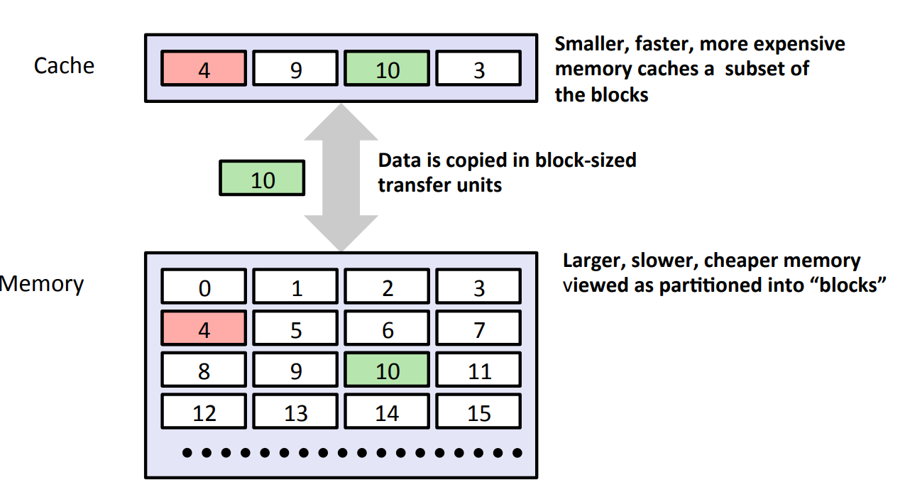

!!!note
    虽然课程中主要讲述的是**CPU中的cache（高速缓存）**，其作为**内存的cache**，但cache实际上是一个十分宽泛的概念，任何小而快的存储设备都可以看作是更大且更慢的设备的cache，其核心是利用**空间局部性**和**时间局部性**。比如内存实际上可以作为磁盘的cache，这在后续的虚拟内存章节也会更加细致的讲述，亦或是使用Redis作为数据库的cache。总而言之，cache的概念在系统设计中非常重要，需要同学们深入理解和掌握。

### Cache 基本结构

在cache中，最基本的单位是cache line。任何不同的cache结构，都是将cache line以不同的方式组织起来，其中主要包括**组相联（set associative）**，**直接映射（direct mapped）**和**全相联（fully associative）**。其中后两种组织方式都可以看作第一种组织方式的特殊形式。下面，我们将围绕这些部分重点进行讲解。

### Cache Line

每个Cache Line由三部分构成：

- 有效位(valid bit)：指示Cache Line是否有效。Cache Line有效意味着它存储着来自主存的数据块；否则Cache Line的其他信息都是无效的，应该被忽略。
- 标记位(tag bit)：帮助确定Cache Line中存储的数据地址。
- 数据块(block)：主存中某个数据块的副本。

!!!note
    我们常说的cache hit，从cache line的角度来看实际上就是满足两点：

    - valid字段有效
    - tag字段匹配

Cache工作时，在Cache看来，主存的地址被分成三部分，如下图所示：

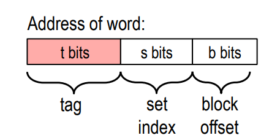

其中，$s$位的Set Index字段（组索引）是$S$个Cache Set的索引。例如，第一个组的索引是$0$，第二个组的索引是$1$, 以此类推。Set Index字段告诉我们这个数据必须存在哪个Cache Set中。

$t$位的Tag字段是用来确定该Cache Line是否存储着目标地址的数据。

$b$位Block Offset是可以在确定目标数据在块中偏移量。

!!!note
    Cache Line是cache和cache以及cache和内存之间的**最小传输单位**，其大小一般指**block**，也就是数据块的大小，常见为64字节，当然也存在32字节或者128字节等，在实际的实现中，cache line内部的block和tag字段也通常是**两个独立的内存区域**。 
    
    正如课本在前面几章提到的，CPU内部的数据处理通常以**字**为单位，比如常见的64位CPU，其一次处理的数据大小就是64位，或者说字长为64位，也就是8字节。这也决定了CPU内部的寄存器宽度是64位（当然有些SIMD指令可能用到128或者256位寄存器）。 

    那为什么cache line的大小通常会大于CPU字长呢，一个原因是**空间局部性**，因为访问某个内存地址后，有很大概率会访问其附近的地址，因此将附近这一片连续的内存数据全部加载到cache中，对于良好的空间局部性的程序来说性能就可以得到很大的优化。另一个原因则是一次操作一块数据可以**均摊**诸如总线传输等带来的开销。对于CPU来说，如果要从cacheline中访问，通常是将需要的数据（通常8字节）从数据块中加载到寄存器中，再进行访问。对于cache和内存之间的交互，一般设计上会将cacheline和内存的**突发传输大小（burst length）**进行对齐，而这个大小一般是64字节。内存使用**突发传输数据方式**也是为了优化内存总线的带宽使用，这里不展开讲，感兴趣的同学可以自行google有关dram内存结构和时序的内容。

### Cache Line组织方式

一般而言，cache在逻辑上可以看作关于cache line组织而成的**二维数组**，这通常形成了最通用的**组相联（set associative）**结构，如下图所示：

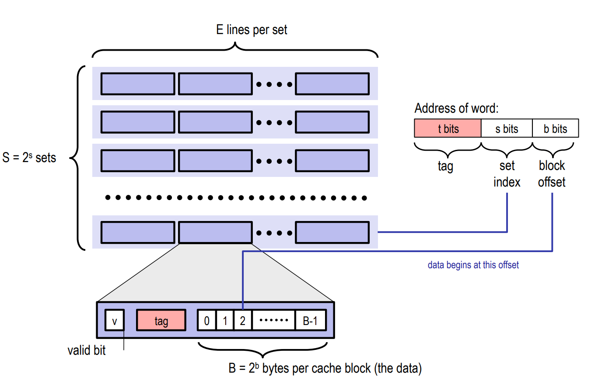

其中，这个二维数组的**行数**，决定了组相连的Set数量，课本中使用$S$表示。而每个组内部的cache line的个数，也就是二维数组的**列数**，决定了**相联度（associativity）**，课本上使用$E$表示。比如，一个组内包含了8个cache line, 那么通常叫做**8路组相联（8-way）**

上述的结构有两个发展的方向，因此也有两个极端，一个方向是增加行数，也就是Set的数量，另一个方向就是增加列数，也就是associativity。

假设Set数量只有一个，那实际上就形成了**全相联（fully associative）**结构，数据块可以放入cache中的任何位置，只要有空闲空间。

假设associativity的数量只有一个，即每个组内只有一个cacheline，这实际上就形成了**直接映射（direct mapped）**结构，即数据块被**唯一分配**到一个组内。

!!!note
    在计算机系统中，很多时候很难评价一种系统的好坏，因为某个系统在某个场景下可能性能很差，但是在另一个场景下可能非常适用，很多时候系统设计需要考虑的就是**trade-off**，即以牺牲一些其他方面的性能为代价，换取在某个方面极致的优化，从而**针对某个场景带来巨大的收益**。

    上述三种cache结构亦是如此，对于直接映射的方式，由于每个组内只有一个cache line，大大简化了cache查找和evict的逻辑，因此cache hit的时延可以很低，但同时由于只有一个cache line，cache miss率将大大提高。对于全相联结构，只要cache有空闲块，就可以存储数据，因此可以大大降低cache miss率，但同时也大大增加了查找和evict的复杂度，因此增加了访问时延。对于组相联结构，目标就是在二者之间寻找一个平衡。

### 如何处理写操作

cache处理写操作的流程比读取要复杂，因为写入操作涉及**数据的更改**，一旦涉及修改操作，就会带来各种一致性问题，因此cache需要合理的处理数据更改的时机和范围。同时还需要处理写miss的情况。我们在这里简要介绍一下有关写cache的一些问题和处理机制。

一般而言，对于写入操作，cache一般有两种处理机制，分别是：

- **write back（写回）**：即数据的修改只发生在当前这一级cache中，通常会引入一个**dirty**标记位，表示cache中的数据和下一级cache（或内存）中的数据**不一致**，只有在当前的cacheline被evict的时候才会将数据写回到下一级cache（或内存）。
- **write through（写直达）**：顾名思义，写入操作会同时将数据写入到当前cache和下一级cache（或内存中），因此二者的数据是同步的。

除了上述的两种策略，cache还需要确定如何处理write miss的情况，一般而言，也有两种方法：

- **write allocate（写分配）**：当发生cache miss时，需要访问下一级cache（或内存）将需要的cache line加载到当前cache中，然后再修改这个cache line中的内容
- **no write allocate（写不分配）**：当发生cache miss时，无需修改当前cache中的内容，直接写入下一级cache（或内存）

上述策略两两组合可以产生4种不同的写策略，但是一般常见的只有以下两种：

- **write back/write allocate**：即写回+写分配策略
- **write through/no write allocate**：即写直达+写不分配策略

大家可以自己思考一下为什么另外两种搭配方式不常见。🤔

有关write back/write allocate的写入流程如下（图源自[wiki: cache write policy](https://en.wikipedia.org/wiki/Cache_(computing))）：

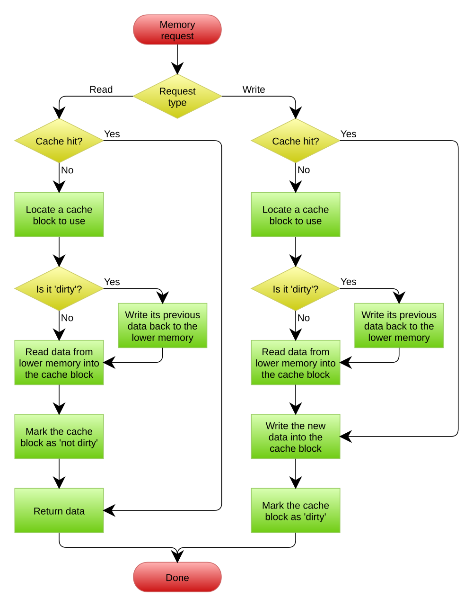

有关write through/no write allocate的写入流程如下（图源自[wiki: cache write policy](https://en.wikipedia.org/wiki/Cache_(computing))）：

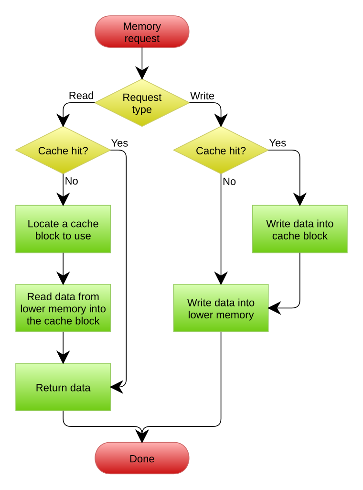

!!!note
    实际上，在现代的CPU中，几乎每一级cache都使用的是write back/write allocate策略，而write through策略只在早期AMD的CPU上的L1D cache使用过。

    write through的好处是简化了数据一致性的处理，但是会引发大量的总线流量，而访问内存又是一个比较慢的操作（相对于CPU来说），因此对于write through cache通常会额外引入一块write buffer，用来缓冲大量的写入流量。

    write back不会产生大量的总线流量，因此性能较好，但是会产生数据一致性问题，因此需要更复杂的机制来保证数据一致性。不过随着技术的发展，write back带来的收益已经超过write through带来的收益，因此write through已经逐渐淘汰了。

### Cache 相关统计量

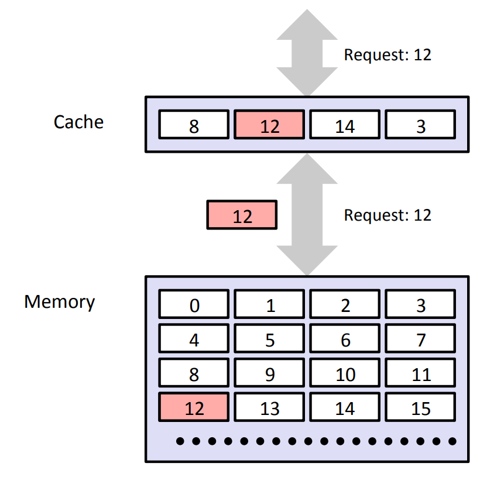

#### Cache Hit

对于上面的图，如果程序需要Memory层的数据对象d，它会首先访问Cache，如发现Cache中恰好存在数据对象d（例如访问8），此时就叫Cache Hit（命中）。

当发生Cache Hit时，程序就不用访问主存了，直接从Cache读取目标数据即可。

#### Cache Miss

如果程序需要主存的数据对象d，它首先访问Cache，发现Cache中并没有存储数据对象d对应的数据块(block)，此时就叫Cache Miss (不命中)。

当发生Cache Miss时，Cache层会从主存中取出包含d的数据块，然后根据地址中的Set Index找到Cache中的对应Cache Set。如果这个Cache Set中还有空的Cache Line（即Valid Bit = 0），直接存入，并更新Tag字段和Valid位；否则，需要进行Cache Line替换，Cache Line替换需要覆盖一个块，所以也可以称为Cache Eviction。

#### Cache Eviction

上述Cache Line替换的过程是需要覆盖原有的一个块的，所以可以称为Cache Eviction。一个Cache Set中有多个Cache Line，替换时需要决定替换哪个Cache Line，这是由Cache替换策略决定的，例如常见的最近最少被使用策略(LRU策略)会替换掉一个访问时间距离现在最长的块。

### 多级cache组织方式

现代CPU中，CPU和内存的速度差距越来越大。因此CPU内部往往不会仅采用一级cache，而是使用多级cache结构，以**优化最坏情况（从内存访问）下的性能**。多级cache结构的组织又会引入很多的问题，我们在这里简单讲述一些重要的问题，其他的一些细节问题感兴趣的同学可以自行google。

### Memory Hierarchy

根据我们课程中的学习，不同存储技术的访问时间差别很大，但速度较快的技术每字节的成本要比速度慢的技术高，而且容量小。现代计算机系统往往采用存储器层次结构的方法，下图展示了一个典型的存储器层次结构。

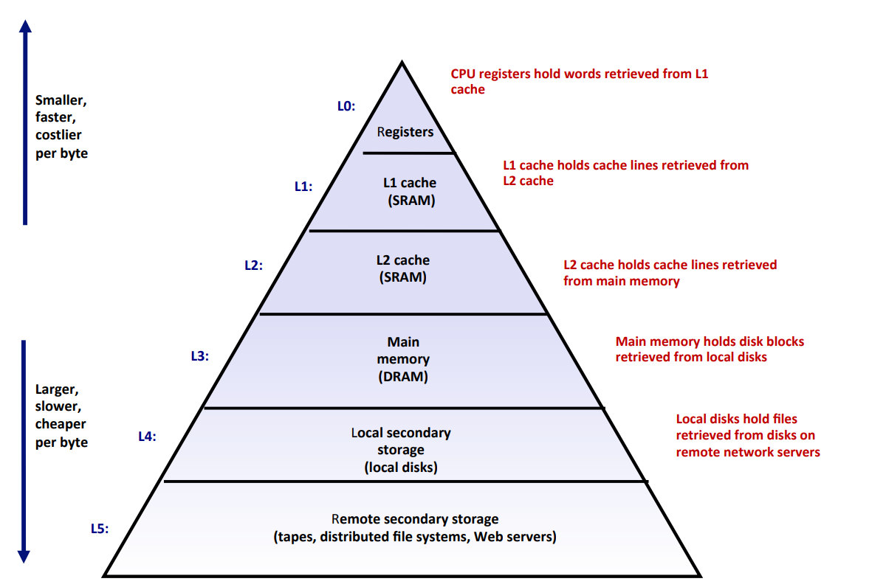

存储器层次结构的中心思想是：对于每个k，位于k层的更快更小的存储设备作为位于k+1层的更大更慢的存储设备的cache。即每一层的cache的内容均来自于较低一层的数据对象。例如图中，L2 cache(SRAM)作为L3 主存的cache。

这样的体系结构，使得整体计算机的整体存储系统呈现出高速且大容量的整体特性。

### 多级cache的包含准则（inclusion policy）

!!!danger
    这一部分在课程中可能讲述较少，同时与实验内容**强相关**，因此强烈建议阅读本节。如果你有任何困惑，可以上piazza提问并讨论，或者自行google相关wiki和他人写的博客进行学习。

正如上述的内存层次结构所提到的，对于二级及以上的cache，一种常见的组织方式是较小且位于高层次的cache作为较大且位于低层次的cache的子集。即所有在高层次cache中存放的数据**一定**也存在于低层次中，但在低层次中拥有的数据则不一定在高层次中存在。

上述这种组织方式叫做**inclusive policy(包含性策略)**，这也是你需要在本次实验中实现的策略，当然还存在另外两种策略，分别是**exclusive policy**和**non-inclusive-non-exclusive(NINE)**策略，三种方式各有好坏，这些策略的集合通常叫做**inclusion policy**，即包含准则，这是设计实现多级cache时必须要确定的一个因素（你可以假设内存是一个最大的集合，包含所有数据）。

我们将简要介绍inclusive policy，如果你对其他策略感兴趣，可以自行查阅[wiki: cache inclusion policy](https://en.wikipedia.org/wiki/Cache_inclusion_policy)。

考虑一个二级缓存结构，这里借用[wiki: cache inclusion policy](https://en.wikipedia.org/wiki/Cache_inclusion_policy)上的一张图来表示：

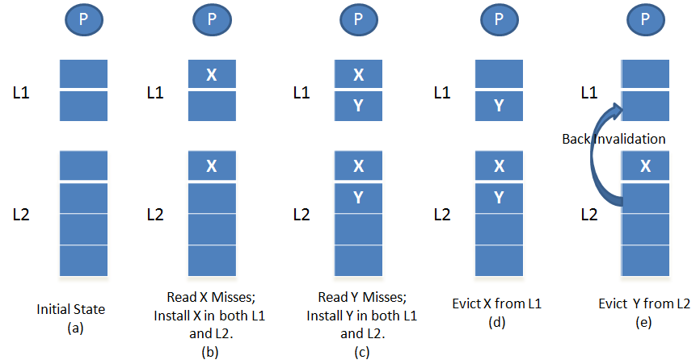

对于上述结构，如果要满足L2始终包括L1的所有数据这样一条性质的话，则在cache之间的访问需要满足以下要求：

- 如果L1 hit, 则直接返回
- 如果L1 miss, L2 hit, 则需要访问L2，并且将这个cache line复制到L1中
- 如果L1 需要evict一个cache line用来放置从L2得到cache line, 则evict过程不会对L2产生影响（实际上，还需要考虑写策略的影响，这里聚焦于inclusion policy，因此不考虑具体的写入策略）
- 如果L1和L2均miss，则需要访问内存，并且将cache line加载到**L2和L1中**
- 如果L2 需要而evict一个cache line，则L2 需要 **back invalidation（回溯失效）** L1，即在L1中寻找对应的cache line，并且将其evict。

大家可以自行想一下为什么对于**inclusive policy**，步骤4和5是必要的。😊

## 开始实验

首先进入实验目录`cachelab-sp25`，然后运行`ls`查看文件：

```bash
$ cd cachelab-sp25
$ ls
cache-impl.c  csim.c           driver.py   test-trans.c   traces-data-intensive/
cachelab.c    csim-ref-partA*  Makefile    tracegen.c     traces-hard/
cachelab.h    csim-ref-partB*  test-csim*  traces-basic/  trans.c
```

你可以尝试运行`make`进行编译：

```bash
$ make
gcc -g -Wall -Werror -m64 -o csim csim.c cachelab.c cache-impl.c
gcc -g -Wall -Werror -m64 -O0 -c trans.c
gcc -g -Wall -Werror -m64 -o test-trans test-trans.c cachelab.c trans.o
gcc -g -Wall -Werror -m64 -O0 -o tracegen tracegen.c trans.o cachelab.c
```

此时再次运行`ls`，得到的输出如下：

```bash
$ ls
cache-impl.c  csim.c           Makefile      tracegen*               traces-hard/
cachelab.c    csim-ref-partA*  test-csim*    tracegen.c              trans.c
cachelab.h    csim-ref-partB*  test-trans*   traces-basic/           trans.o
csim*         driver.py        test-trans.c  traces-data-intensive/
```

下面是对于实验文件的详细解释：

- `cachelab.h/cachelab.c`：包含了本次实验的一些helper function
- `cache-impl.c`：cache模拟器的源文件，是在**Part A中唯一需要修改**的文件
- `csim.c`：cache模拟器的入口文件，助教们在这个文件中帮大家实现好了主要的处理逻辑
- `csim-ref-partA`：参考cache模拟器，可以与自己的实现进行比对，将在Part A中使用
- `test-csim`：用于Part A测试的文件
— `traces-*`：三个目录，用于存放在Part A中用于测试的文件
- `csim-ref-partB`：在Part B中使用的cache模拟器
- `trans.c`：Part B中你需要修改的文件
- `tracegen.c`：生成`tracegen`的源文件
- `tracegen`：Part B中用于生成trace的可执行程序
- `test-trans`：测试Part B部分的可执行文件
- `driver.py`：用于测试Part A + Part B总得分的脚本

## Part A：三级Cache模拟器

在Part A中，你需要实现一个三级Cache模拟器，这个模拟器将会读取`traces-*`目录下的trace文件，然后开始运行，从而达到模拟cache访问的效果。

### 三级缓存结构的基本配置

本次实验中，需要实现的三级cache结构如下：

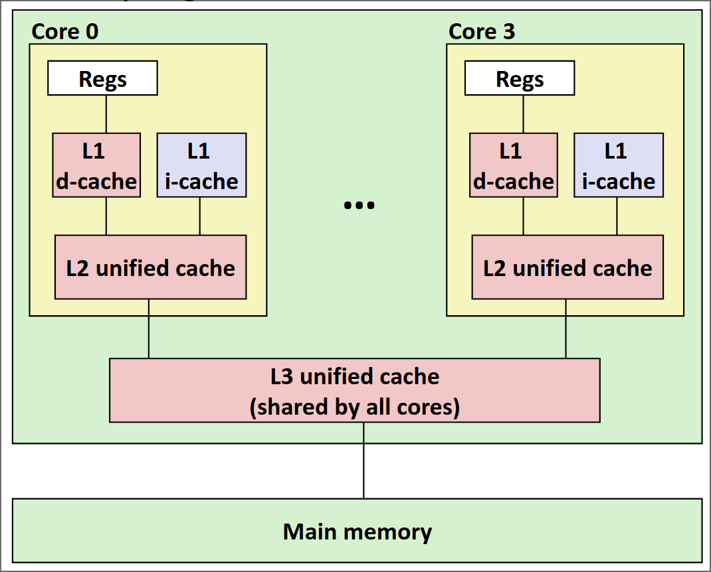

其中：

- L1分为L1D（数据读写）和L1I（指令读取）两个分离的cache，并且L1I是**只读**的。
- L1和L2为**每个核心私有**
- L2为unfied cache，也就是会**同时存储指令和数据**
- L3为unfied cache，且**所有核心共享**

!!!note
    上述结构实际上就是真实CPU内部的多级cache结构，但是本次实验中，**你可以假设所有指令都是one by one执行**，且**只有一个核心**。换句话说，你**无需考虑多线程并发访问和核心之间缓存一致性**的问题。

每个cache的具体配置如下：

- L1D(I) cache
    - size: 64B
    - set: 4
    - associativity: 2-way
    - cache line size: 8B
    - write policy: write back + write allocate
- L2 cache
    - size: 256B
    - set: 8
    - associativity: 4-way
    - cache line size: 8B
    - write poliy: write back + write allocate
    - inclusion policy: inclusive
- L3 cache
    - size: 2KB
    - set: 16
    - associativity: 8-way
    - cache line size: 16B
    - write policy: write back + write allocate
    - inclusion policy: inclusive

!!!warning
    再阅读下一部分之前，请确保自己已经**完全理解**上述cache配置中的每一行配置要求。如果你感受到任何的困惑，建议立即停止并且阅读**实验前置知识**一节。

### Trace文件简介

在`cachelab-sp25`目录下的`traces`目录中有许多以`.trace`结尾的文件，我们称它们为trace文件。trace文件中是一系列访存日志，它作为Part A中Cache模拟器的输入，用来判断程序的正确性。trace文件是通过`Valgrind`工具生成的。

!!!note
    `Valgrind`是一款用于内存调试、内存泄漏检测以及性能分析的软件开发工具。

例如：

```shell
$ valgrind --log-fd=1 --tool=lackey -v --trace-mem=yes ls -l
```

以上命令可以输出执行`ls -l`命令时实际产生的所有内存访问日志。

trace文件的格式如下：

```plain
I 0400d7d4,8
 M 0421c7f0,4
 L 04f6b868,8
 S 7ff0005c8,8
```

每一行代表一个内存访问指令，每个指令可能会有一次或两次的内存访问，每一行的格式如下：

```plain
[space]operation address,size
```

- `operation`表示内存访问指令的类型，分为4种：
  - `I`表示一条指令的加载（Instruct）
  - `L`表示数据读取（Load）
  - `S`表示数据存储（Store）
  - `M`表示数据修改（Modify）（**实际上是一次Load再加一次Store**）
  - **注意**：在trace文件中，`I`前面**没有空格**，但是`M`，`L`，`S`前面**一定有一个空格**。
- `address` 表示一个64位**十六进制**内存地址。
- `size`表示本次内存访问的字节数。

### 实验内容及步骤

不知道大家在看到实验目录下那么多的文件之后，是否感受到头昏眼花了呢？不过，不用担心，为了减轻同学们的负担，助教们已经将大部分代码框架搭建好了，大家只需要在给定的框架中填充代码即可~

在Part A中，你**唯一需要**完成的文件是`cache-impl.c`文件，除此之外，你**严禁修改其他任何文件，包括删除现有文件或者自行创建新文件**。否则可能造成**本地评测和提交之后的评测结果不一致，或者无法编译通过**，产生的**一切后果由自己承担**。⚠️

正如前面提到的，在Part A中你需要实现一个三级cache模拟器。作为参考标准，我们提供了一个已经正确实现的cache模拟器作为参考标准，以**二进制可执行程序**的形式发放，命名为`csim-ref-partA`。

!!!warning
    假如你缺少这个程序，或者程序损坏无法运行，请立刻联系助教进行处理。

这个程序接受多个命令行参数，可以通过下面这条命令查看其用法：

```bash
$ ./csim-ref-partA -h
usage: ./csim-ref-partA -t trace_file [-h] [-n] [-v] [-l level] [-d] [-i] [-s set] [-b breakpoint] 
options: 
-h, --help         print this
-o, --output       output file
-t, --trace        input trace file (required)
-n, --snapshot     print cache snapshot
-b, --breakpoint   print cache info after one specified access, note that it can not be enabled in verbose mode
-v, --verbose      print information after each cache access, instead of print snapshot at the end
-l, --level        which cache level [l1--1, l2--2, l3--3] to print (only can be specified when [-n] is enabled)
-d, --data         data cache (must be specified if level == 1)
-i, --instruction  instruction cache (must be specified if level == 1 )
-s, --set          which cache set (index start from 0) to print (only can be specified when [-l] is enabled)
```

下面是对上述参数的具体解释：

- `-h`：可选，打印帮助信息
- `-n`：可选， 打印快照信息
- `-o`：可选，指定输出信息的文件路径，默认是标准输出
- `-v`：可选，以详细模式打印信息，这种模式下，相关的统计量和快照信息会在每次进行一次cache访问之后打印，默认是全部trace访问完成之后打印。
- `-t`: **必选**，指定输入trace文件的路径
- `-b`：可选，断点功能，将会打印在某一次cache访问之后的cache状态，注意这个参数**不能和`-v`同时使用**

为了测试cache的正确性以及方便大家debug，助教们为大家写好了打印快照的函数，可以打印所有cache line中的tag，valid和dirty字段的值。

打印快照的功能通过`-n`参数开启，默认在完成所有cache访问后，打印所有cache line的信息。

如果你不想要所有的cache line内容，可以在**开启快照之后（即指定了-n参数）**指定打印哪个cache，以及哪个cache的哪个set，这些通过**参数+值**的形式来实现：

- `-l <level>`：可选，指定打印哪一级cache，可选值为[1, 2, 3]，分别代表L1, L2和L3 cache
- `[-d -i]`：可选，分别表示dcache和icache，当level指定为1时，你需要**至少指定一个参数**
- `-s <set>`：可选，指定打印某一个cache set，使用此参数时，你**必须先指定level**

下面是一个典型的运行结果：

```bash
$ ./csim-ref-partA -t traces-basic/l1Devict.trace
L1-d cache hits:0 misses:4 evictions:2
L1-i cache hits:0 misses:0 evictions:0
L2 cache hits:2 misses:3 evictions:0
L3 cache hits:0 misses:3 evictions:0
```

使用`-n`开启快照，并且使用`-v`打印详细信息。

```bash
$ ./csim-ref-partA -vnt traces-basic/l1Devict.trace
0: S 0 8
L1-d cache hits:0 misses:1 evictions:0
L1-i cache hits:0 misses:0 evictions:0
L2 cache hits:0 misses:1 evictions:0
L3 cache hits:0 misses:1 evictions:0
l1-d cache[0][0]: valid=1, dirty=1, tag=0
l1-d cache[0][1]: valid=0, dirty=0, tag=0
l1-d cache[1][0]: valid=0, dirty=0, tag=0
l1-d cache[1][1]: valid=0, dirty=0, tag=0
l1-d cache[2][0]: valid=0, dirty=0, tag=0
l1-d cache[2][1]: valid=0, dirty=0, tag=0
l1-d cache[3][0]: valid=0, dirty=0, tag=0
l1-d cache[3][1]: valid=0, dirty=0, tag=0
l1-i cache[0][0]: valid=0, dirty=0, tag=0
l1-i cache[0][1]: valid=0, dirty=0, tag=0
l1-i cache[1][0]: valid=0, dirty=0, tag=0
l1-i cache[1][1]: valid=0, dirty=0, tag=0
l1-i cache[2][0]: valid=0, dirty=0, tag=0
l1-i cache[2][1]: valid=0, dirty=0, tag=0
l1-i cache[3][0]: valid=0, dirty=0, tag=0
l1-i cache[3][1]: valid=0, dirty=0, tag=0
l2 cache[0][0]: valid=1, dirty=0, tag=0
l2 cache[0][1]: valid=0, dirty=0, tag=0
...
l2 cache[7][0]: valid=0, dirty=0, tag=0
l2 cache[7][1]: valid=0, dirty=0, tag=0
l2 cache[7][2]: valid=0, dirty=0, tag=0
l2 cache[7][3]: valid=0, dirty=0, tag=0
l3 cache[0][0]: valid=1, dirty=0, tag=0
l3 cache[0][1]: valid=0, dirty=0, tag=0
l3 cache[0][2]: valid=0, dirty=0, tag=0
l3 cache[0][3]: valid=0, dirty=0, tag=0
l3 cache[0][4]: valid=0, dirty=0, tag=0
l3 cache[0][5]: valid=0, dirty=0, tag=0
...
l3 cache[15][6]: valid=0, dirty=0, tag=0
l3 cache[15][7]: valid=0, dirty=0, tag=0
1: L 20 8
```

这会在每一次访问之后打印具体的**访问指令**，当前的**统计量**和**cache的快照**等。

如果你只对L2感兴趣，可以指定打印L2的某一个set：

```bash
$ ./csim-ref-partA -vnt traces-basic/l1Devict.trace -l 2 -s 4
0: S 0 8
L1-d cache hits:0 misses:1 evictions:0
L1-i cache hits:0 misses:0 evictions:0
L2 cache hits:0 misses:1 evictions:0
L3 cache hits:0 misses:1 evictions:0
l2 cache[4][0]: valid=0, dirty=0, tag=0
l2 cache[4][1]: valid=0, dirty=0, tag=0
l2 cache[4][2]: valid=0, dirty=0, tag=0
l2 cache[4][3]: valid=0, dirty=0, tag=0
1: L 20 8
L1-d cache hits:0 misses:2 evictions:0
L1-i cache hits:0 misses:0 evictions:0
L2 cache hits:0 misses:2 evictions:0
L3 cache hits:0 misses:2 evictions:0
l2 cache[4][0]: valid=1, dirty=0, tag=0
l2 cache[4][1]: valid=0, dirty=0, tag=0
l2 cache[4][2]: valid=0, dirty=0, tag=0
l2 cache[4][3]: valid=0, dirty=0, tag=0
2: L 40 8
L1-d cache hits:0 misses:3 evictions:1
L1-i cache hits:0 misses:0 evictions:0
L2 cache hits:1 misses:3 evictions:0
L3 cache hits:0 misses:3 evictions:0
l2 cache[4][0]: valid=1, dirty=0, tag=0
l2 cache[4][1]: valid=0, dirty=0, tag=0
l2 cache[4][2]: valid=0, dirty=0, tag=0
l2 cache[4][3]: valid=0, dirty=0, tag=0
3: L 0 8
L1-d cache hits:0 misses:4 evictions:2
L1-i cache hits:0 misses:0 evictions:0
L2 cache hits:2 misses:3 evictions:0
L3 cache hits:0 misses:3 evictions:0
l2 cache[4][0]: valid=1, dirty=0, tag=0
l2 cache[4][1]: valid=0, dirty=0, tag=0
l2 cache[4][2]: valid=0, dirty=0, tag=0
l2 cache[4][3]: valid=0, dirty=0, tag=0
```

如果你需要全部的cache信息，而只对某一次访问结束之后的cache信息感兴趣，你可以使用`-b`参数指定breakpoint：

```bash
$ ./csim-ref-partA -nt traces-basic/l1Devict.trace -l 2 -s 4 -b 2
2: L 40 8
L1-d cache hits:0 misses:3 evictions:1
L1-i cache hits:0 misses:0 evictions:0
L2 cache hits:1 misses:3 evictions:0
L3 cache hits:0 misses:3 evictions:0
l2 cache[4][0]: valid=1, dirty=0, tag=0
l2 cache[4][1]: valid=0, dirty=0, tag=0
l2 cache[4][2]: valid=0, dirty=0, tag=0
l2 cache[4][3]: valid=0, dirty=0, tag=0
L1-d cache hits:0 misses:4 evictions:2
L1-i cache hits:0 misses:0 evictions:0
L2 cache hits:2 misses:3 evictions:0
L3 cache hits:0 misses:3 evictions:0
l2 cache[4][0]: valid=1, dirty=0, tag=0
l2 cache[4][1]: valid=0, dirty=0, tag=0
l2 cache[4][2]: valid=0, dirty=0, tag=0
l2 cache[4][3]: valid=0, dirty=0, tag=0
```

这将会打印行数为2（行数从0开始）的指令访问之后的cache信息。

当然，上述参数可以自由组合，不过注意要遵守其约定。

简单来说，你的任务就是实现这样一个模拟器，从命令行读取trace文件进行模拟，要求是输出需要和我们提供的标准cache模拟器**完全一致**

有关文件读取和命令行参数的处理，以及cache结构的声明，助教们已经帮大家完成了：

有关cache的结构，大家可以查看`cachelab.h`文件：

```c
// cachelab.h
...

#define L1_SET_NUM 4
#define L1_LINE_NUM 2
#define L1_CACHELINE_SIZE 8

#define L2_SET_NUM 8
#define L2_LINE_NUM 4
#define L2_CACHELINE_SIZE 8

#define L3_SET_NUM 16
#define L3_LINE_NUM 8
#define L3_CACHELINE_SIZE 16

#define ADDRESS_LENGTH 64

...

typedef struct {
  bool valid;
  bool dirty;
  uint64_t tag;
  uint64_t latest_used; // for LRU
} CacheLine;

extern CacheLine l1dcache[L1_SET_NUM][L1_LINE_NUM];
// L1 Instruction Cache
extern CacheLine l1icache[L1_SET_NUM][L1_LINE_NUM];
// L2 Unified Cache
extern CacheLine l2ucache[L2_SET_NUM][L2_LINE_NUM];
// L2 Unified Cache
extern CacheLine l3ucache[L3_SET_NUM][L3_LINE_NUM];

...
```

里面声明了有关cache配置的一些宏定义和cache line的结构体，以及使用二维数组的方式来组织cache，在开始实验之前，你需要读懂并理解这个文件中有关cache定义的内容，且**禁止修改任何内容**。

在`csim.c`中，助教们已经帮大家写好了命令行参数处理的逻辑，以及文件读取的逻辑，具体如下：

```c
// csim.c
...

  cacheInit(); // implemented in cache-impl.c

  char buf[BUF_SIZE];
  uint64_t addr;
  uint32_t len;
  char op;
  while (fgets(buf, BUF_SIZE, trace_fp)) {
    if (buf[0] == 'I') {
      op = buf[0];
    } else if (buf[0] == ' ') {
      op = buf[1];
    } else {
      continue; // ignore empty lines and lines begin with '='
    }
    sscanf(buf + 3, "%lx,%d", &addr, &len);
    // to be implemented in csim.c
    if (verbose == 1 || (current_line == breakpoint)) {
      fprintf(out, "%ld: %c %lx %d\n", current_line, op, addr, len);
    }
    cacheAccess(op, addr, len); // implemented in cache-impl.c
    if (verbose == 1 || (current_line == breakpoint)) {
      printSummary(l1d_hits, l1d_misses, l1d_evictions, l1i_hits, l1i_misses,
                   l1i_evictions, l2_hits, l2_misses, l2_evictions, l3_hits,
                   l3_misses, l3_evictions);
      if (snapshot == 1) {
        printSnapshot();
      }
    }
    current_line++;
  }
...
```

具体而言，上述代码首先通过`cacheInit()`函数初始化cache，然后循环读取trace文件的每一行，并且提取出cache访问的一些必要信息，最后调用函数`cacheAccess()`真正访问cache，这两个函数定义在`cache-impl.c`中。

和上述一样，在开始之前，你需要完全理解上述逻辑（不必是整个`csim.c`文件），特别是`cacheInit()`和`cacheAccess()`接口的定义，并且**禁止修改有关这个文件里面的任何内容**。

`cacheInit`函数不接受任何参数，它的目标是对所有cache进行初始化。

!!!note
    实际上，C语言的全局变量在被加载到内存时，如果没有初始化，会被**默认初始化为0**。因此，对于cacheInit函数，你可以什么都不做，但是这个函数放在这的目的就是为了告诉大家初始化的重要性。

`cacheAccess`函数接受三个参数，参数的定义为：

- 第一个参数为访问类型，是一个`char`类型的参数，具体取值和trace文件中的类型相同，为[`I`, `S`, `L`，`M`]其中的一个。
- 第二个参数为访问地址，它是**trace文件中的地址的十进制表示**的结果
- 第三个参数为一次访问的长度，也就是字节数量

最后，终于迎来了我们的主角，`cache-impl.c`。简单来说，你只需要完成这个文件预留的两个函数`cacheInit()`和`cacheAccess()`即可。

为了给同学们自由的发挥空间，助教们仅给出了函数接口，而没有限制具体的实现方法。注意，在这个文件中，**你不可以修改上述两个函数的接口定义（也就是变量类型，个数等），也不可以修改有关cache的12个统计量的定义**，但是，你**可以在这个文件中添加任何需要的头文件，并且定义任何你需要的数据结构和函数**。

```c
// cache-impl.c
#include "cachelab.h"
#include <stdint.h>
// feel free to include any files you need above

int l1d_hits = 0;
int l1d_misses = 0;
int l1d_evictions = 0;
int l1i_hits = 0;
int l1i_misses = 0;
int l1i_evictions = 0;
int l2_hits = 0;
int l2_misses = 0;
int l2_evictions = 0;
int l3_hits = 0;
int l3_misses = 0;
int l3_evictions = 0;

// you can add your own data structures and functions below

// you are not allowed to modify the declaration of this function
void cacheInit() {
  // TODO
}

// you are not allowed to modify the declaration of this function
void cacheAccess(char op, uint64_t addr, uint32_t len) {
  // TODO
}
```

要注意的是，你需要实现的三级cache模拟器必须保证**严格的包含关系（见实验前置知识一节）**，并且需要和标准的cache模拟器输出相同。因此，你实现的cache访问流程必须遵循下面的要求：

假设当前访问第 i 级cache

1. 根据内存地址得到相应的tag，set, block等字段的值
2. 检查第 i 级cache是否命中
3. 如果命中，跳到**第8步**
4. 否则，继续访问下一级cache（或内存）获取数据
5. 在本级cache对应的set中找一个invalid的cache line，用于放置从下一级cache（或内存）加载的cache line，如果有多个invalid的cache line，**选择下标最小的一个**，然后跳到**第8步**
6. 如果在第5步对应的set已满，你需要**首先evict一个cache line**，evict的过程**使用LRU算法**，如果evict的cache line是dirty的，你需要首先将其写入到下一级缓存（或内存）
7. 由于**inclusive policy**，你可能需要back invalidation第 i - 1 级cache中的cache line
8. 设置这个cache line对应的tag字段，LRU字段和valid字段
9. 如果访问模式是**写操作**，设置dirty字段
10. 返回

如果看完上述描述，你仍然感觉一头雾水，不要担心，没有什么办法是比看一个例子更好的了。助教们因此特地准备了一份样例，其中cache和内存的组织结构如下（为了简单起见，这是全相联的cache）。其中，在一个cache set中，cache line的下标从左到右依次增大：

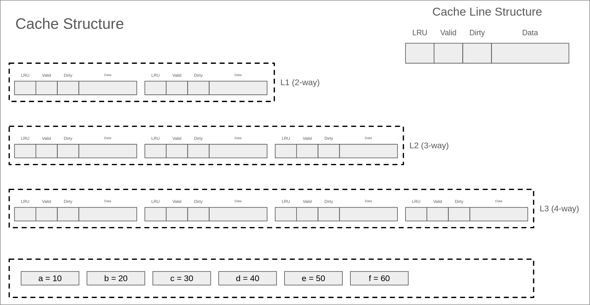

cache的访问trace依次为：

- Read a
- Read b
- Read a
- Write b
- Read c
- Write a
- Read d
- Read c
- Write b
- Write c
- Read e
- Read f
- Read b
- Read d

!!!note
    在这个简单的例子中，你可以假设每个变量会占用整个cache line，并且三级cache的cache line大小是一样的。换句话说，读取变量a放入cache的时候，a的数据宽度和cache line的大小是一致的。

我们**强烈建议**大家在正式开始写代码之前，自己把上述的过程**完整的画一遍**，特别是注意cache访问中**访问顺序（序号），LRU的设置，evict的过程，cache miss时的处理流程**，以及back invalidation的过程，完整的答案在[这里](../assets/files/cache.pdf)，有任何疑惑，欢迎上piazza进行提问。

!!!tip
    这里给出一些**可能有用**的建议：

    - 在访问cache之前，你需要正确的初始化所有的cache line, 换句话说，你需要把所有的字段全部初始化为0
    - 你可以假设，对于单个cache的访问，不会出现跨两个cache line的情况，换句话说，你可以**忽略cacheAccess函数中的第三个参数**
    - 对于`M`类型的访问，你可以等价的将他看作为**一次读取和一次写入**
    - 需要注意的是，L2和L3 cache会同时包含指令和数据
    - 你可以假设指令和数据不会访问同一块内存，换句话说，你可以假设L2中的某个cache line不会同时出现在L1D cache和L1I cache中
    - 本次实验仅要求模拟cache访问，因此你**无需关心具体的写入数据**
    - 你可以使用位运算相关技巧从传入的地址中提取出tag，set，block等信息
    - 你可以使用位运算相关技巧根据tag，set，block的信息拼接出内存地址
    - 在每次访问某个cache时，你需要对这个cache的三个统计量（hit, miss, eviction）进行更新，包括对L1的读取/写入，对L2的读取，对L3的读取，L1写回脏数据到L2，L2写回到L3等
    - 在加载一条cache line时，你需要在当前cache set中找出一条可用的cache line, 换句话说，你需要找到**一条valid字段为false**的cache line。如果有多条可用的cache line，你需要选择**下标最小的一个**
    - 你需要**严格使用LRU算法**来找到需要evict的cache line
    - 你可以简单使用循环的方式来暴力实现LRU，而不考虑复杂度的问题，为此，你可以维护一个全局时钟并且仔细的设置cache line结构中的latest_used字段
    - 在evict一条cache line时，你需要考虑dirty字段的影响，换句话说，如果dirty为true，你需要在加载新的cache line之前，将旧的cache line写回到下一级cache（或内存）。如果dirty为false，你可以简单的将这条cache line丢弃
    - 你在进行evict的时候，无需对evict的cache line的LRU字段进行改动
    - 你需要在每次成功访问一条cache line之后设置LRU字段，成功访问指写入/读取命中，或者是**从下级缓存加载了相应的cache line之后**的读取/写入操作
    - 在发生conflict miss时，你需要严格遵守**先fetch，后evict**的过程，即先访问下一级缓存或者内存得到数据所在的cache line，再选择需要evict的cache line，这**可能会影响LRU设置的顺序**。考虑一个例子，假如某个时刻全局时钟为10，L1发生conflict miss，L2 hit，你需要首先访问L2，由于L2 hit，设置L2中对应的cache line的LRU为10，然后将cache line返回给L1，假设L1需要evict的cache line是dirty的，你需要将其首先写回L2，这是100% hit的（为什么？），因此设置L2中对应的cache line的LRU为11，最后将需要的cache line放置在L1经evict空出的位置上，然后设置对应的LRU为12
    - 本次实验要求上一级cache的内容一定存在于下一级cache中，这叫做inclusive policy。你需要时刻保证这一条性质，并且好好利用它
    - 受限于inclusive policy，写回脏数据的过程实际上是100% hit的，你需要合理的安排代码顺序实现这一点
    - 当你处理write miss时，需要首先访问下一级缓存（或者内存）获取cache line，然后再写入这条cache line。在此过程中，你需要仔细思考对于下一级缓存应该**以什么类型进行访问**
    - 如果你需要从L2 evict某个cache line，假设这个cache line也存在于L1, 你需要将L1中对应的cache line也进行evict，这个过程叫做back invalidation。如果L1中的数据是dirty的，你需要首先将其写回L2。
    - 如果你需要从L3 evict一个cache line，你也需要分别将L1和L2中对应的cache line进行evict。在此过程中，你需要好好思考evict的顺序，以保证inclusive的性质。
    - 你在back invalidation的时候可能需要evict上级cache的cache line，但是**无需更改evict的计数**
    - 注意，不同级别的缓存cache line的大小可能是不一样，你在设计代码的时候需要考虑这会产生哪些影响，并仔细的处理相关流程

### 本地测试

Part A部分将会使用`traces-basic`，`traces-data-intensive`和`traces-hard`三个目录下的trace文件进行测试，**你同样不允许修改任何trace文件**，测试难度**由易到难**，具体要求为：

- `traces-basic/`：里面包含了12个**human-made**的，和一些简单的综合trace。一般只有几行到几十行不等，覆盖了大部分cache的访问路径。每个trace 5分，正确通过这个目录中的所有trace之后，你将得到基本的60分。
- `traces-data-intensive/`：里面的trace来自于10个常见的数据密集型负载，并且剔除了指令访问，只关注于数据访问，trace行数从几千行到十几万行不等。每个trace 3分，正确通过所有trace之后，你将得到额外的30分
- `traces-hard`：里面的trace来自于10个真实的负载，包含了所有的指令和数据访问，trace行数从几万行到一百多万行不等。每个trace 1分，正确通过所有trace之后，你将得到最后的10分

我们会使用`./test-csim`来测试你实现的模拟器，简单来说，测试会依次运行所有trace文件，并且在一个文件的**所有指令访问结束之后**查看cache的有关统计量，这些统计量需要和我们的参考模拟器的输出完全相同。

下面是一个参考的输出：

```bash
$ ./test-csim
Start testing basic traces...
Testcase                                     Lines     Result    Random    Score     
---------------------------------------------------------------------------------
traces-basic/l3evict.trace                   15        PASS      IGNORE    5/5       
traces-basic/mixed-2.trace                   90        PASS      IGNORE    5/5       
traces-basic/l1Dhit.trace                    4         PASS      IGNORE    5/5       
traces-basic/backinvalidation.trace          23        FAIL      IGNORE    0/5       
  Details for trace <traces-basic/backinvalidation.trace>
                          Your simulator           Reference simulator
     Level      Hits    Misses    Evicts      Hits    Misses    Evicts
      L1 D         4        19        14         4        19        14
      L1 I         0         0         0         0         0         0
        L2        10        16         9        10        16        10
        L3         6        16         8         6        16         8
traces-basic/mixed-1.trace                   40        PASS      IGNORE    5/5       
traces-basic/l1Devict.trace                  3         PASS      IGNORE    5/5       
traces-basic/l2evict.trace                   7         PASS      IGNORE    5/5       
traces-basic/l1missl2hit.trace               5         PASS      IGNORE    5/5       
traces-basic/l1Ihit.trace                    5         PASS      IGNORE    5/5       
traces-basic/l1Ievict.trace                  5         PASS      IGNORE    5/5       
traces-basic/mixed-3.trace                   128       PASS      IGNORE    5/5       
traces-basic/l1missl2missl3hit.trace         6         PASS      IGNORE    5/5       
---------------------------------------------------------------------------------
Total Score: 55 / 60
   11 passed,     1 failed,    12 total

Start testing data-intensive traces...
Testcase                                     Lines     Result    Random    Score     
---------------------------------------------------------------------------------
traces-data-intensive/multiply.trace         25347     PASS      IGNORE    3/3       
traces-data-intensive/add.trace              16451     PASS      IGNORE    3/3       
traces-data-intensive/convolve.trace         80397     PASS      IGNORE    3/3       
traces-data-intensive/sort.trace             8369      PASS      IGNORE    3/3       
traces-data-intensive/grep.trace             38328     FAIL      IGNORE    0/3       
  Details for trace <traces-data-intensive/grep.trace>
                          Your simulator           Reference simulator
     Level      Hits    Misses    Evicts      Hits    Misses    Evicts
      L1 D     37306      1066      1057     37306      1066      1058
      L1 I         0         0         0         0         0         0
        L2       310       863       829       310       863       831
        L3       643       273       145       643       273       145
traces-data-intensive/inner_product.trace    16388     PASS      IGNORE    3/3       
traces-data-intensive/long.trace             267988    FAIL      IGNORE    0/3       
  Details for trace <traces-data-intensive/long.trace>
                          Your simulator           Reference simulator
     Level      Hits    Misses    Evicts      Hits    Misses    Evicts
      L1 D     14206      2182      2046    230444     56520     53285
      L1 I         0         0         0         0         0         0
        L2         1      2182      2150     47391     27797     24629
        L3      1154      1029       901     33435     11645     11517
traces-data-intensive/link_list.trace        49878     FAIL      IGNORE    0/3       
  Details for trace <traces-data-intensive/link_list.trace>
                          Your simulator           Reference simulator
     Level      Hits    Misses    Evicts      Hits    Misses    Evicts
      L1 D     23530     27047     26988     23528     27049     26986
      L1 I         0         0         0         0         0         0
        L2      9098     20867     20710      9088     20879     20710
        L3     12219     10106      9978     12220     10121      9993
traces-data-intensive/transpose.trace        6147      FAIL      IGNORE    0/3       
  Details for trace <traces-data-intensive/transpose.trace>
                          Your simulator           Reference simulator
     Level      Hits    Misses    Evicts      Hits    Misses    Evicts
      L1 D      2597      3550      3498      2597      3550      3499
      L1 I         0         0         0         0         0         0
        L2      2242      2332      2296      2242      2332      2300
        L3      3056       292       164      3056       292       164
traces-data-intensive/wc.trace               26311     FAIL      IGNORE    0/3       
  Details for trace <traces-data-intensive/wc.trace>
                          Your simulator           Reference simulator
     Level      Hits    Misses    Evicts      Hits    Misses    Evicts
      L1 D     25488       865       856     25488       865       857
      L1 I         0         0         0         0         0         0
        L2       276       698       664       276       698       666
        L3       486       265       138       486       265       138
---------------------------------------------------------------------------------
Total Score: 15 / 30
    5 passed,     5 failed,    10 total

Start testing hard traces...
Testcase                                     Lines     Result    Random    Score     
---------------------------------------------------------------------------------
traces-hard/multiply.trace                   149382    PASS      IGNORE    1/1       
traces-hard/add.trace                        94710     PASS      IGNORE    1/1       
traces-hard/ls.trace                         56756     FAIL      IGNORE    0/1       
  Details for trace <traces-hard/ls.trace>
                          Your simulator           Reference simulator
     Level      Hits    Misses    Evicts      Hits    Misses    Evicts
      L1 D      1337      3412       806      1337      3412       802
      L1 I     26377     25721     25666     26377     25721     25672
        L2      1351     28190     28129      1351     28190     28158
        L3     17768     10806     10678     17768     10806     10678
traces-hard/convolve.trace                   1848393   FAIL      IGNORE    0/1       
  Details for trace <traces-hard/convolve.trace>
                          Your simulator           Reference simulator
     Level      Hits    Misses    Evicts      Hits    Misses    Evicts
      L1 D     54747     25650      3049     54747     25650      3048
      L1 I   1084283    683713    683703   1084282    683714    683706
        L2    667993     44315     44259    667974     44335     44263
        L3     46182      1078       950     46202      1078       950
traces-hard/sort.trace                       45978     PASS      IGNORE    1/1       
traces-hard/grep.trace                       406467    FAIL      IGNORE    0/1       
  Details for trace <traces-hard/grep.trace>
                          Your simulator           Reference simulator
     Level      Hits    Misses    Evicts      Hits    Misses    Evicts
      L1 D     22544     15828       504     22544     15828       502
      L1 I    184075    184064    184012    184075    184064    184016
        L2    118023     81983     81941    118023     81983     81951
        L3     79669      2416      2288     79669      2416      2288
traces-hard/inner_product.trace              98329     PASS      IGNORE    1/1       
traces-hard/link_list.trace                  249719    FAIL      IGNORE    0/1       
  Details for trace <traces-hard/link_list.trace>
                          Your simulator           Reference simulator
     Level      Hits    Misses    Evicts      Hits    Misses    Evicts
      L1 D     21914     27578     20747     21914     27578     20748
      L1 I    150210     50708     46836    150210     50708     46850
        L2      8714     72902     72720      8714     72902     72823
        L3     55772     19960     19832     55772     19960     19832
traces-hard/transpose.trace                  31990     FAIL      IGNORE    0/1       
  Details for trace <traces-hard/transpose.trace>
                          Your simulator           Reference simulator
     Level      Hits    Misses    Evicts      Hits    Misses    Evicts
      L1 D      2472      3675      3005      2472      3675      3005
      L1 I     16309      9534      9195     16309      9534      9192
        L2     10703      3530      3493     10700      3533      3495
        L3      4242       307       179      4245       307       179
traces-hard/wc.trace                         404114    FAIL      IGNORE    0/1       
  Details for trace <traces-hard/wc.trace>
                          Your simulator           Reference simulator
     Level      Hits    Misses    Evicts      Hits    Misses    Evicts
      L1 D      9093     17260       416      9093     17260       415
      L1 I    155362    222441    222397    155362    222441    222399
        L2    153542     86278     86243    153542     86278     86246
        L3     84456      1929      1801     84456      1929      1801
---------------------------------------------------------------------------------
Total Score: 4 / 10
    4 passed,     6 failed,    10 total

Testing cache simulator done. Total scores: 74 / 100
Totally 2.795767 seconds passed.
```

上述输出拿到了74分，下面具体解释一下这个输出结果：

- 在**Result**一栏会显示对于某个trace的测试结果（PASS/FAIL）
- 每一行代表一个trace测试，最右边一栏将会显示这个trace的得分
- 你必须保证4个cache，共12个统计量和我们的参考模拟器的输出完全相同，才能得到这一个trace的分
- Lines一列显示了每个trace文件的指令行数，比如`traces-hard`存在一个184万行的trace
- 如果一个trace **FAIL**了，程序将会打印你的模拟器和参考模拟器的输出供你比对
- 每通过一个`traces-*`目录的检查，程序将会打印这一部分的总得分。在三个部分的trace全部检查完毕后，会在最后打印part A总得分，这也将是你整个cachelab的最终得分

测试程序的输出还有Random一栏，这是用于随机测试，他将在每个trace中随机打入断点查看状态（实际上，现在的实现是**伪随机数**，也就是每次运行打入断点的位置是一样的），开启随机测试之后，你需要**额外**通过随机测试，才能拿到对应的分数。可以通过`-r（--random）`参数来开启：

```bash
$ ./test-csim -r
Start testing basic traces...
Testcase                                     Lines     Result    Random    Score     
---------------------------------------------------------------------------------
traces-basic/l3evict.trace                   15        PASS      PASS      5/5       
traces-basic/mixed-2.trace                   90        PASS      PASS      5/5       
traces-basic/l1Dhit.trace                    4         PASS      PASS      5/5       
traces-basic/backinvalidation.trace          23        FAIL      PASS      0/5       
  Details for trace <traces-basic/backinvalidation.trace>
                          Your simulator           Reference simulator
     Level      Hits    Misses    Evicts      Hits    Misses    Evicts
      L1 D         4        19        14         4        19        14
      L1 I         0         0         0         0         0         0
        L2        10        16         9        10        16        10
        L3         6        16         8         6        16         8
traces-basic/mixed-1.trace                   40        PASS      PASS      5/5       
traces-basic/l1Devict.trace                  3         PASS      PASS      5/5       
traces-basic/l2evict.trace                   7         PASS      PASS      5/5       
traces-basic/l1missl2hit.trace               5         PASS      PASS      5/5       
traces-basic/l1Ihit.trace                    5         PASS      PASS      5/5       
traces-basic/l1Ievict.trace                  5         PASS      PASS      5/5       
traces-basic/mixed-3.trace                   128       PASS      PASS      5/5       
traces-basic/l1missl2missl3hit.trace         6         PASS      PASS      5/5       
---------------------------------------------------------------------------------
Total Score: 55 / 60
   11 passed,     1 failed,    12 total

Start testing data-intensive traces...
Testcase                                     Lines     Result    Random    Score     
---------------------------------------------------------------------------------
traces-data-intensive/multiply.trace         25347     PASS      PASS      3/3       
traces-data-intensive/add.trace              16451     PASS      PASS      3/3       
traces-data-intensive/convolve.trace         80397     PASS      PASS      3/3       
traces-data-intensive/sort.trace             8369      PASS      PASS      3/3       
traces-data-intensive/grep.trace             38328     FAIL      PASS      0/3       
  Details for trace <traces-data-intensive/grep.trace>
                          Your simulator           Reference simulator
     Level      Hits    Misses    Evicts      Hits    Misses    Evicts
      L1 D     37306      1066      1057     37306      1066      1058
      L1 I         0         0         0         0         0         0
        L2       310       863       829       310       863       831
        L3       643       273       145       643       273       145
traces-data-intensive/inner_product.trace    16388     PASS      PASS      3/3       
traces-data-intensive/long.trace             267988    FAIL      FAIL      0/3       
  Details for random_test of trace <traces-data-intensive/long.trace> at line 191914
                          Your simulator           Reference simulator
     Level      Hits    Misses    Evicts      Hits    Misses    Evicts
      L1 D      4703       724       674    164840     40662     38417
      L1 I         0         0         0         0         0         0
        L2         1       724       692     34223     19817     17805
        L3       382       343       215     24289      7880      7752
  Details for trace <traces-data-intensive/long.trace>
                          Your simulator           Reference simulator
     Level      Hits    Misses    Evicts      Hits    Misses    Evicts
      L1 D     14206      2182      2046    230444     56520     53285
      L1 I         0         0         0         0         0         0
        L2         1      2182      2150     47391     27797     24629
        L3      1154      1029       901     33435     11645     11517
traces-data-intensive/link_list.trace        49878     FAIL      FAIL      0/3       
  Details for random_test of trace <traces-data-intensive/link_list.trace> at line 20095
                          Your simulator           Reference simulator
     Level      Hits    Misses    Evicts      Hits    Misses    Evicts
      L1 D      9691     10766     10735      9691     10766     10735
      L1 I         0         0         0         0         0         0
        L2      4615      7901      7834      4613      7903      7834
        L3      5536      3298      3170      5535      3301      3173
  Details for trace <traces-data-intensive/link_list.trace>
                          Your simulator           Reference simulator
     Level      Hits    Misses    Evicts      Hits    Misses    Evicts
      L1 D     23530     27047     26988     23528     27049     26986
      L1 I         0         0         0         0         0         0
        L2      9098     20867     20710      9088     20879     20710
        L3     12219     10106      9978     12220     10121      9993
traces-data-intensive/transpose.trace        6147      FAIL      FAIL      0/3       
  Details for random_test of trace <traces-data-intensive/transpose.trace> at line 3741
                          Your simulator           Reference simulator
     Level      Hits    Misses    Evicts      Hits    Misses    Evicts
      L1 D      1581      2161      2123      1581      2161      2124
      L1 I         0         0         0         0         0         0
        L2      1362      1421      1385      1362      1421      1389
        L3      1831       203        75      1831       203        75
  Details for trace <traces-data-intensive/transpose.trace>
                          Your simulator           Reference simulator
     Level      Hits    Misses    Evicts      Hits    Misses    Evicts
      L1 D      2597      3550      3498      2597      3550      3499
      L1 I         0         0         0         0         0         0
        L2      2242      2332      2296      2242      2332      2300
        L3      3056       292       164      3056       292       164
traces-data-intensive/wc.trace               26311     FAIL      PASS      0/3       
  Details for trace <traces-data-intensive/wc.trace>
                          Your simulator           Reference simulator
     Level      Hits    Misses    Evicts      Hits    Misses    Evicts
      L1 D     25488       865       856     25488       865       857
      L1 I         0         0         0         0         0         0
        L2       276       698       664       276       698       666
        L3       486       265       138       486       265       138
---------------------------------------------------------------------------------
Total Score: 15 / 30
    5 passed,     5 failed,    10 total

Start testing hard traces...
Testcase                                     Lines     Result    Random    Score     
---------------------------------------------------------------------------------
traces-hard/multiply.trace                   149382    PASS      PASS      1/1       
traces-hard/add.trace                        94710     PASS      PASS      1/1       
traces-hard/ls.trace                         56756     FAIL      FAIL      0/1       
  Details for random_test of trace <traces-hard/ls.trace> at line 22142
                          Your simulator           Reference simulator
     Level      Hits    Misses    Evicts      Hits    Misses    Evicts
      L1 D       491      1367       343       491      1367       340
      L1 I     10312      9995      9973     10312      9995      9977
        L2       495     10995     10951       495     10995     10963
        L3      6809      4309      4181      6809      4309      4181
  Details for trace <traces-hard/ls.trace>
                          Your simulator           Reference simulator
     Level      Hits    Misses    Evicts      Hits    Misses    Evicts
      L1 D      1337      3412       806      1337      3412       802
      L1 I     26377     25721     25666     26377     25721     25672
        L2      1351     28190     28129      1351     28190     28158
        L3     17768     10806     10678     17768     10806     10678
traces-hard/convolve.trace                   1848393   FAIL      FAIL      0/1       
  Details for random_test of trace <traces-hard/convolve.trace> at line 1519250
                          Your simulator           Reference simulator
     Level      Hits    Misses    Evicts      Hits    Misses    Evicts
      L1 D     45078     21104      2507     45078     21104      2506
      L1 I    890860    562209    562199    890859    562210    562202
        L2    549267     36461     36409    549252     36477     36413
        L3     37983       893       765     37999       893       765
  Details for trace <traces-hard/convolve.trace>
                          Your simulator           Reference simulator
     Level      Hits    Misses    Evicts      Hits    Misses    Evicts
      L1 D     54747     25650      3049     54747     25650      3048
      L1 I   1084283    683713    683703   1084282    683714    683706
        L2    667993     44315     44259    667974     44335     44263
        L3     46182      1078       950     46202      1078       950
traces-hard/sort.trace                       45978     PASS      PASS      1/1       
traces-hard/grep.trace                       406467    FAIL      FAIL      0/1       
  Details for random_test of trace <traces-hard/grep.trace> at line 353639
                          Your simulator           Reference simulator
     Level      Hits    Misses    Evicts      Hits    Misses    Evicts
      L1 D     19638     13505       249     19638     13505       247
      L1 I    160211    160291    160267    160211    160291    160270
        L2    103376     70431     70394    103376     70431     70399
        L3     68999      1443      1315     68999      1443      1315
  Details for trace <traces-hard/grep.trace>
                          Your simulator           Reference simulator
     Level      Hits    Misses    Evicts      Hits    Misses    Evicts
      L1 D     22544     15828       504     22544     15828       502
      L1 I    184075    184064    184012    184075    184064    184016
        L2    118023     81983     81941    118023     81983     81951
        L3     79669      2416      2288     79669      2416      2288
traces-hard/inner_product.trace              98329     PASS      PASS      1/1       
traces-hard/link_list.trace                  249719    FAIL      FAIL      0/1       
  Details for random_test of trace <traces-hard/link_list.trace> at line 232167
                          Your simulator           Reference simulator
     Level      Hits    Misses    Evicts      Hits    Misses    Evicts
      L1 D     21466     25232     19908     21466     25232     19909
      L1 I    142794     43367     39495    142794     43367     39509
        L2      8211     63222     63040      8211     63222     63143
        L3     45883     19677     19549     45883     19677     19549
  Details for trace <traces-hard/link_list.trace>
                          Your simulator           Reference simulator
     Level      Hits    Misses    Evicts      Hits    Misses    Evicts
      L1 D     21914     27578     20747     21914     27578     20748
      L1 I    150210     50708     46836    150210     50708     46850
        L2      8714     72902     72720      8714     72902     72823
        L3     55772     19960     19832     55772     19960     19832
traces-hard/transpose.trace                  31990     FAIL      PASS      0/1       
  Details for trace <traces-hard/transpose.trace>
                          Your simulator           Reference simulator
     Level      Hits    Misses    Evicts      Hits    Misses    Evicts
      L1 D      2472      3675      3005      2472      3675      3005
      L1 I     16309      9534      9195     16309      9534      9192
        L2     10703      3530      3493     10700      3533      3495
        L3      4242       307       179      4245       307       179
traces-hard/wc.trace                         404114    FAIL      FAIL      0/1       
  Details for random_test of trace <traces-hard/wc.trace> at line 39935
                          Your simulator           Reference simulator
     Level      Hits    Misses    Evicts      Hits    Misses    Evicts
      L1 D       888      1857       149       888      1857       148
      L1 I     15451     21743     21727     15451     21743     21728
        L2     14491      9116      9083     14491      9116      9084
        L3      8363       760       632      8363       760       632
  Details for trace <traces-hard/wc.trace>
                          Your simulator           Reference simulator
     Level      Hits    Misses    Evicts      Hits    Misses    Evicts
      L1 D      9093     17260       416      9093     17260       415
      L1 I    155362    222441    222397    155362    222441    222399
        L2    153542     86278     86243    153542     86278     86246
        L3     84456      1929      1801     84456      1929      1801
---------------------------------------------------------------------------------
Total Score: 4 / 10
    4 passed,     6 failed,    10 total

Testing cache simulator done. Total scores: 74 / 100
Totally 2.826064 seconds passed.
```

开启随机测试之后，在Random一栏会显示PASS或者FAIL（否则为IGNORE），同时在FAIL时会相应的输出打入断点的那一行的详细信息，供你进行比对。

!!!tip
    - 你应该首先保证最基础的60分，也就是通过`traces-basic`目录下的所有trace，这些trace文件比较短，方便debug
    - 你应该**灵活使用**前面介绍过的参数进行debug
    - 你可以将输出**重定向**到临时文件中以进行debug，注意，产生的输出文件可能会很大，尤其是开启了**快照**的情况下，请提前预留足够的磁盘空间（大约30-50G）
    - **禁止打表**，我们在最后测试的时候会**随机设置断点（会和你自己进行的随机测试设置的断点不同）**来检查你的程序是否正确，这也是测试输出的**Random**一栏，在开启Random测试后，你需要额外通过random的检查来拿到满分
    - 如果你想确保万无一失，可以使用`-vt`参数并和我们的参考模拟器进行比对，这会在每一次cache访问之后输出cache的状态（也就是12个统计量）。如果完全一致，那随机测试就一定可以通过
    - 你需要注意超时的问题，我们在./test-csim中设置了30秒超时，也就是说，你的程序需要在30秒内通过**所有trace**的测试（一般正确实现的程序只需要**几秒钟**即可跑完所有测试），否则你只能得到在**超时之前PASS的trace**的分数。

下面是一个典型的超时结果：

```bash
$ ./test-csim
Start testing basic traces...
Testcase                                     Lines     Result    Random    Score     
---------------------------------------------------------------------------------
traces-basic/l3evict.trace                   15        PASS      IGNORE    5/5       
traces-basic/mixed-2.trace                   90        PASS      IGNORE    5/5       
traces-basic/l1Dhit.trace                    4         PASS      IGNORE    5/5       
traces-basic/backinvalidation.trace          23        FAIL      IGNORE    0/5       
  Details for trace <traces-basic/backinvalidation.trace>
                          Your simulator           Reference simulator
     Level      Hits    Misses    Evicts      Hits    Misses    Evicts
      L1 D         4        19        14         4        19        14
      L1 I         0         0         0         0         0         0
        L2        10        16         9        10        16        10
        L3         6        16         8         6        16         8
traces-basic/mixed-1.trace                   40        PASS      IGNORE    5/5       
traces-basic/l1Devict.trace                  3         PASS      IGNORE    5/5       
traces-basic/l2evict.trace                   7         PASS      IGNORE    5/5       
traces-basic/l1missl2hit.trace               5         PASS      IGNORE    5/5       
traces-basic/l1Ihit.trace                    5         PASS      IGNORE    5/5       
traces-basic/l1Ievict.trace                  5         PASS      IGNORE    5/5       
traces-basic/mixed-3.trace                   128       PASS      IGNORE    5/5       
traces-basic/l1missl2missl3hit.trace         6         PASS      IGNORE    5/5       
---------------------------------------------------------------------------------
Total Score: 55 / 60
   11 passed,     1 failed,    12 total

Start testing data-intensive traces...
Testcase                                     Lines     Result    Random    Score     
---------------------------------------------------------------------------------
traces-data-intensive/multiply.trace         25347     PASS      IGNORE    3/3       
traces-data-intensive/add.trace              16451     PASS      IGNORE    3/3       
traces-data-intensive/convolve.trace         80397     PASS      IGNORE    3/3       
traces-data-intensive/sort.trace             8369      PASS      IGNORE    3/3       
traces-data-intensive/grep.trace             38328     FAIL      IGNORE    0/3       
  Details for trace <traces-data-intensive/grep.trace>
                          Your simulator           Reference simulator
     Level      Hits    Misses    Evicts      Hits    Misses    Evicts
      L1 D     37306      1066      1057     37306      1066      1058
      L1 I         0         0         0         0         0         0
        L2       310       863       829       310       863       831
        L3       643       273       145       643       273       145
traces-data-intensive/inner_product.trace    16388     PASS      IGNORE    3/3       
traces-data-intensive/long.trace             267988    FAIL      IGNORE    0/3       
  Details for trace <traces-data-intensive/long.trace>
                          Your simulator           Reference simulator
     Level      Hits    Misses    Evicts      Hits    Misses    Evicts
      L1 D     14206      2182      2046    230444     56520     53285
      L1 I         0         0         0         0         0         0
        L2         1      2182      2150     47391     27797     24629
        L3      1154      1029       901     33435     11645     11517
traces-data-intensive/link_list.trace        49878     FAIL      IGNORE    0/3       
  Details for trace <traces-data-intensive/link_list.trace>
                          Your simulator           Reference simulator
     Level      Hits    Misses    Evicts      Hits    Misses    Evicts
      L1 D     23530     27047     26988     23528     27049     26986
      L1 I         0         0         0         0         0         0
        L2      9098     20867     20710      9088     20879     20710
        L3     12219     10106      9978     12220     10121      9993
traces-data-intensive/transpose.trace        6147      FAIL      IGNORE    0/3       
  Details for trace <traces-data-intensive/transpose.trace>
                          Your simulator           Reference simulator
     Level      Hits    Misses    Evicts      Hits    Misses    Evicts
      L1 D      2597      3550      3498      2597      3550      3499
      L1 I         0         0         0         0         0         0
        L2      2242      2332      2296      2242      2332      2300
        L3      3056       292       164      3056       292       164
traces-data-intensive/wc.trace               26311     FAIL      IGNORE    0/3       
  Details for trace <traces-data-intensive/wc.trace>
                          Your simulator           Reference simulator
     Level      Hits    Misses    Evicts      Hits    Misses    Evicts
      L1 D     25488       865       856     25488       865       857
      L1 I         0         0         0         0         0         0
        L2       276       698       664       276       698       666
        L3       486       265       138       486       265       138
---------------------------------------------------------------------------------
Total Score: 15 / 30
    5 passed,     5 failed,    10 total

Start testing hard traces...
Testcase                                     Lines     Result    Random    Score     
---------------------------------------------------------------------------------
traces-hard/multiply.trace                   149382    PASS      IGNORE    1/1       
traces-hard/add.trace                        94710     PASS      IGNORE    1/1       
TIMEOUT! Running tests over 30 seconds! Please check your program!

Testing cache simulator done. Total scores: 72 / 100
```

上述程序在测试`traces-hard/`发生了超时，在超时之前一共获得了72分，超时后，无法继续后面的测试，因此总共得分72分。

### 思考题

这一部分列举一些cache设计上的问题和取舍，**没有标准答案**，也**不会影响你的实验分数**，学有余力的同学可以思考下列问题，也欢迎大家在piazza上进行讨论

- 在这个实验中一直强调的一个点是Inclusive policy，这种设计方法在以前的CPU，特别是Intel的CPU中很常见，但其实现代的CPU以及逐渐转向使用NINE模式，因此会产生以下问题：
    - 使用Inclusive policy的缓存必须满足什么条件？这样设计的优缺点分别是什么？
    - NINE策略不要求低级cache强制包含高级cache内容，这样做相比inclusive的好处和坏处分别是什么？
    - 本次实验实际上借助inclusive的性质大大简化了设计，如果采用NINE结构，你将如何调整你的代码？
- 现代CPU几乎都采用L1D和L1I两种缓存结构，而在L2及更低级的缓存使用统一指令和数据的方式，这么做的好处是什么？
- 你觉得CPU是如何区分指令内存和数据内存的访问的？
- 本次实验要求实现严格的LRU算法，一种暴力实现方式是遍历所有cache line, 这样时间复杂度为$O(E)$，你可以设计一种复杂度为$O(1)$的实现方式吗
- LRU算法在某种特定的情形下会造成100% miss，你可以发现这种访问模式吗？
- 实际硬件中，实现LRU算法其实十分昂贵，因此大多数厂家采用近似LRU的方法，如果让你设计，你会如何设计这种算法？
- 本次实验中在实现上有个小细节是，在发生conflict miss时，我们总是先从下一级fetch数据，然后再判断是否需要evict，这样做的好处和不足是什么？如果上述两个操作的流程互换之后，带来的好处和坏处是什么？你可能需要综合考虑inclusive policy带来的影响。
- 进行cache访问时，需要根据内存地址提取出tag，set等字段，而CPU产生的地址实际上都是虚拟地址，需要额外的机制转换成物理地址（详见虚拟内存章节）。因此，cache的设计实际上可以分成physical index和virtual index两种方式，即采用物理地址或者虚拟地址两种地址解析tag，set等内容，那么：
    - 使用physical index的cache的优缺点是什么？
    - 使用virtual index的cache的优缺点是什么？
    - 你能不能设计一种方法综合利用上述两种方式各自的优势？
- 本次实验中实现的模拟器只能应对顺序访问，如果需要扩展你的模拟器以支持多个线程并发访问，你该如何调整现有的代码？
- 本次实验中不要求考虑多核之间的一致性问题，如果考虑多核之间一致性的问题，且L3作为多核之间的共享缓存，你该如何调整现有的代码？
- 在考虑多核之间cache一致性的前提下，如果需要将inclusive策略变成NINE策略，你需要如何改进现有的代码？

!!!note
    对cache优化感兴趣的同学，可以参考[《Computer Architecture: A Quantitative Approach》](../assets/files/Quantitative-Approach 6th.pdf)的第二章和附录B。

    对cache一致性问题感兴趣的同学，可以参考上述书籍中的第5章。

    如果你不理解为什么要学习有关cache和内存的知识，可以阅读这篇论文: [What Every Programmer Should Know About Memory](../assets/files/(Ulrich Drepper) What Every Programmer Should Know About Memory.pdf)。

## Part B: 优化矩阵转置函数

!!! info
    这一部分为**选做**，为了不增加大家学业上的负担，整个Part B部分**不计入总分**（即使这部分的测试脚本可能会给出一个分数），仅供学有余力的同学完成。同时，有各种问题**优先使用piazza进行提问**，不建议直接私聊助教~。

### 实验内容

Part B部分，你需要要在`trans.c`中写一个矩阵转置函数，使其在运行过程中尽可能少地引起Cache Miss。

$A$表示一个矩阵，$A_{i,j}$表示$A$矩阵的第$i$行、第$j$列，矩阵A的转置用$A^T$表示，满足$A_{i,j}=A_{j,i}^T$。

为了让你更好地开始优化转置函数，在`trans.c`中我们给出了一个示例的转置函数，这个函数可以计算$N\times M$矩阵A的转置并存储到$M\times N$矩阵$B$中：

```c
char trans_desc[] = "Simple row-wise scan transpose";
void trans(int M, int N, int A[N][M], int B[M][N])
{
    int i, j, tmp;

    for (i = 0; i < N; i++) {
        for (j = 0; j < M; j++) {
            tmp = A[i][j];
            B[j][i] = tmp;
        }
    }
}
```

显然这个函数是正确的，但是对于Cache而言执行效率很低，会导致大量的Cache Miss，在Part B中你的工作是在`trans.c`中写一个功能相同的函数`transpose_submit`，尽可能地减小Cache Miss次数。

```c
char transpose_submit_desc[] = "Transpose submission";
void transpose_submit(int M, int N, int A[N][M], int B[M][N]) {
  if (M == 32 && N == 32) {
    // you can do 32x32 transpose here
  } else if (M == 64 && N == 64) {
    // you can do 64x64 transpose here
  } else {
    // you can do 61x67 transpose here
  }
}
```

注意不要修改上面的描述字符串`"Transpose submission"`，打分时会寻找这个字符串来确定你提交的函数。

### 本地测试

!!!note
    你可能会奇怪为什么Part B的实验评测部分会在这时候说明，实际上Part B是允许你进行“**面向测试用例编程**”，所以在这里先给给出PartB的所有的测试用例，以及每个测试用例对于Cache Miss次数的要求。

可以通过运行`test-trans`文件来测试你的函数在运行时Cache Miss的数量，例如你想测试你的转置函数对于一个$61\times 67$的矩阵进行转置时Cache Miss的数量，可以使用如下命令进行测试：

```shell
./test-trans -M 61 -N 67
```

命令行中的`-M`以及`-N`后跟的是矩阵的行数和列数。

`./test-trans`会使用另一个cache模拟器`csim-ref-partB`来模拟cache访问，这是一个一级cache。换句话说，你在完成Part B的时候，无需考虑多级cache的问题。

在Part B测试时，**Cache结构是直接映射的，且不会发生改变**，具体参数配置为(s=5, E=1, b=5)：

- size: 1KB
- set: 32
- cache line size: 32B

并且你不需要对于所有的大小的矩阵都完成转置的优化，我们在进行评分的时候**只会**对如下三个测试用例进行测试：

- $32 \times 32$ ($M = 32, N = 32$)
- $64 \times 64$ ($M = 64, N = 64$)
- $61 \times 67$ ($M = 61, N = 67$)

这三个测试用例以及每个测试用例的Cache Miss限制如下（假设某个测试用例中Cache Miss的次数为m）：

- $32\times 32$ : $10$ points if $m < 300$，$0$ points if $m > 600$
- $64\times 64$ : $8$ points  if $m < 1300$，$0$ points if $m > 2000$
- $61\times 67$ : $10$ points if $m < 2000$，$0$ points if $m > 3000$

也就是说，你可以在你的代码中显式地判断输入参数中矩阵的行数和列数，然后对每个测试用例进行单独编程。

!!!note
    在开始写PartB之前请先看一下下面PartB的代码规则部分，明确要求后，你可以省去一些多余的工作。

### 代码规则

1. `trans.c`文件一定要可以正常编译（0 warning 0 error）。
2. 在每个转置函数中，你只允许定义最多12个`int`类型的局部变量。
3. 不允许使用任何`long`类型的变量或者尝试将多个值存储到一个变量中。
4. 不允许使用递归。
5. 如果你选择使用辅助函数，则从转置函数开始的栈中同时存在局部变量数目不能超过12个，例如你的转置函数定义了8个局部变量，转置函数中调用了一个函数定义了2个局部变量，这个函数又定义了4个局部变量，那栈中就会存在14个局部变量，你就违反规则了。
6. 你的转置函数不能修改A矩阵的值，但可以随意修改B矩阵的值。
7. 代码中不允许定义任何数组或者调用类似`malloc`的函数。

在最后评分时，都会按照如上的代码规则进行严苛的检查，请大家注意不要出现超出代码规则的操作。

下面是对于Part B一些**可能有用**的提示：

!!!tip 
    - Cache Miss的三种情况：
        - **Complusory Miss**：在刚开始冷启动的时候，这时候Cache内没有包含任何局部的任何信息，此时Cache Miss是无法忽略的无法避免的，但是准确估计这部分的Cache Miss数量对后续的实现有很多好处。
        - **Capacity Misses**：当你的工作集（Working Set）太大的时候，往往Cache没法保存下所有的信息，此时会出现一些由于容量不足而导致的Cache Miss，比如我们实验中的Cache，通常只能保存下32 * 8个`int`。为了可以减少这种**Capacity Misses**，你可以尝试缩小你的求解问题的规模，大问题转化为小问题，大矩阵转化为几个小矩阵（啊呀我好像说漏嘴了一些关键信息（笑））。
        - **Conflict Misses**：有些时候，不同地址的内容会映射到同一个Cache Line，这会导致简单的操作却反复的出现Cache Miss，一个好的解决方法是，另开空间或者采用临时变量（在本实验中允许12个以内的临时变量），来减轻这些问题的产生。

    - $64\times 64$矩阵转置的优化可能比较复杂，可以先完成$32\times 32$和$61\times 67$矩阵转置的优化，从中寻找灵感，再去完成$64\times 64$矩阵转置的优化。

### Cache性能分析

如果大家看完上面的提示之后还是没有什么思路，不要着急，这一小节对一个简单的矩阵转置函数的Cache Miss次数进行粗略计算，让你了解Cache访问过程，从中你可能会找到减少Cache Miss的办法。

首先我们不考虑什么Cache Miss，仅关注矩阵转置的正确性，你可能会写出如下三行非常精简的代码：

```c
char transpose_submit_desc[] = "Transpose submission";
void transpose_submit(int M, int N, int A[N][M], int B[M][N])
{
    for(int i = 0; i < N; i ++)
        for(int j = 0; j < M; j ++)
            B[j][i] = A[i][j];
}
```

OK，大功告成！这一段代码肯定是功能正确的，于是我们信心满满地开始尝试使用评分软件来测试咱们可以得到的分数。我们把这个代码直接写入`trans.c`，编译后执行测评程序得到的典型运行结果如下

我们直接使用`test-trans`，进行第一个测试用例（$32\times 32$）的测试。

```shell
$ ./test-trans -M 32 -N 32
```

得到的典型输出结果：

```shell
$ ./test-trans -M 32 -N 32

Function 0 (2 total)
Step 1: Validating and generating memory traces
File deleted successfully
Step 2: Evaluating performance (s=5, E=1, b=5)
func 0 (Transpose submission): hits:869, misses:1184, evictions:1152

Function 1 (2 total)
Step 1: Validating and generating memory traces
File deleted successfully
Step 2: Evaluating performance (s=5, E=1, b=5)
func 1 (Simple row-wise scan transpose): hits:869, misses:1184, evictions:1152

Summary for official submission (func 0): correctness=1 misses=1184

TEST_TRANS_RESULTS=1:1184
```

运行结果的输出含义是，在`(s=5, E=1, b=5)`的Cache下，你的函数运行时，Cache Hit的次数是`hits:869`，Cache Miss的次数是`misses:1184`。在Part B评测部分我们提到，如果你想在$32\times 32$的`testcase`下获得满分，你需要把你的程序控制在300次Cache Miss以下。

那我们这里的程序性能到底糟糕在哪呢？这就需要分析一下程序运行的访存过程。

#### 程序运行的Cache访问过程分析

我们的测试场景是一个**直接映射*8的、**Block大小是32字节**的、一共有**32个Cache Set**的Cache模拟器(s=5, E=1, b=5)。

因此测试场景的Cache具有如下的典型结构：

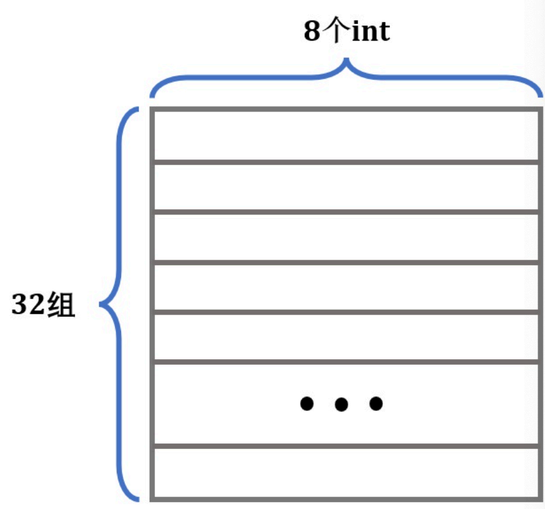

一个Cache Line可以保存8个`int`，我们以这个Cache结构为例，考虑我们刚才的暴力做法：

```c
void transpose_submit(int M, int N, int A[N][M], int B[M][N])
{
    for(int i = 0; i < N; i ++)
        for(int j = 0; j < M; j ++)
            B[j][i] = A[i][j];
}
```

这里我们会按行优先读取`A`矩阵，然后一列一列地写入`B`矩阵。

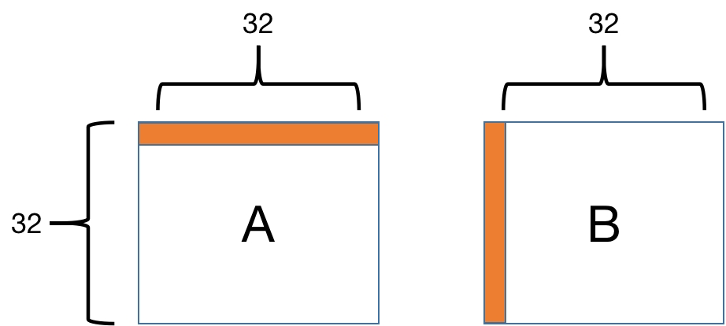

我们知道，Cache是以Cache Line形式读取内存的。以第1行为例，在从内存读 `A[0][0]` 的时候，除了 `A[0][0]` 被加载到Cache中，它之后的 `A[0][1]---A[0][7]` 也会被加载进Cache。

但是内容写入 `B` 矩阵的时候是一列一列地写入，在列上相邻的元素不在一个内存块上，这样每次写入都不命中Cache。并且一列写完之后再返回，原来写入Cache的内容可能被覆盖了，这样就又会不命中。

接下来我们来定量地分析Cache Miss的次数。Cache只够存储一个矩阵的四分之一，`A`中的元素对应的Cache Line每隔8行就会重复。`A`和`B`的地址由于取余关系，每个元素对应的地址是相同的，各个元素对应Cache Line如下：

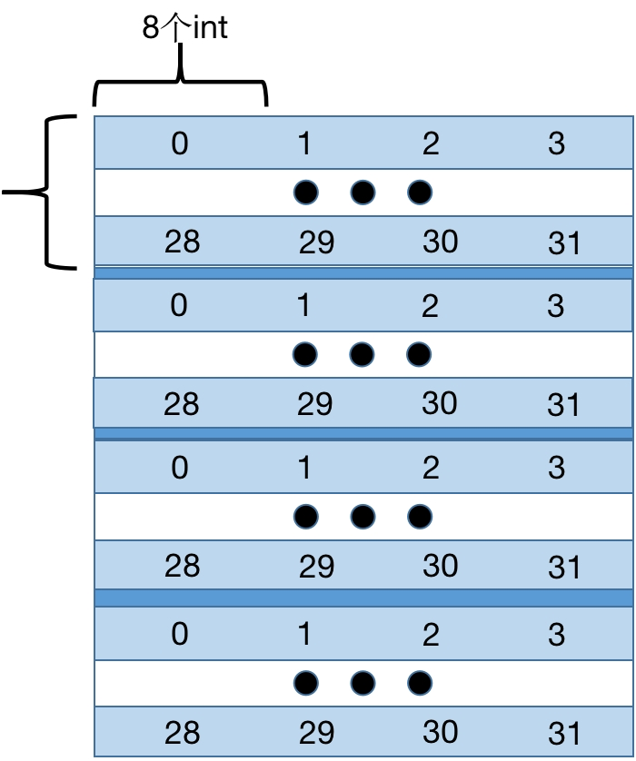

对于`A`，每8个`int`就会占满Cache的一组，所以每一行会有32/8=4次不命中；而对于`B`，考虑最坏情况，每一列都有32次不命中，由此，算出总不命中次数为4×32+32×32=1152。

但是为什么出现了1184次的Cache Miss，这是由于对角线上的元素通常存在一些特殊情况，对角线上的情况请大家自行分析哦~

!!!note
    程序优化的方法有很多，分块访问只是其中的一种，这远远不是极限，为了极致的性能，你还可以尝试SIMD（数据级并行），循环展开，指令级并行，OpenMP等内容。

    对上述内容感兴趣的同学，可以参考[《Computer Architecture: A Quantitative Approach》](../assets/files/Quantitative-Approach 6th.pdf)，详细的介绍了所有体系结构方面的并行处理和优化机制。

    如果你觉得还不过瘾，可以期待[XJTU-ICS Lab5: Optimization Lab](./lab5.md)或者[CS 61C Project4](http://47.108.156.226:8080/projects/proj4/index.html)。😍

## 评分方法

- Part A 100分
- Part B 不计入总分

和往常一样，我们将最终用于评分的`driver.py`脚本也分发给了大家，大家可以用于快速自测分数，使用方法如下：

```shell
$ make
$ python3 driver.py
```

或者：

```bash
$ make
$ make grade
```

!!!note
    先`make`保证当前你的可执行文件已编译为你最新的提交版本

通常来说你会获得类似如下的输出：（这是一个满分输出）

```shell
$ make grade
Part A: Testing cache simulator
Running ./test-csim
Start testing basic traces...
Testcase                                     Lines     Result    Random    Score     
---------------------------------------------------------------------------------
traces-basic/l3evict.trace                   15        PASS      IGNORE    5/5       
traces-basic/mixed-2.trace                   90        PASS      IGNORE    5/5       
traces-basic/l1Dhit.trace                    4         PASS      IGNORE    5/5       
traces-basic/backinvalidation.trace          23        PASS      IGNORE    5/5       
traces-basic/mixed-1.trace                   40        PASS      IGNORE    5/5       
traces-basic/l1Devict.trace                  3         PASS      IGNORE    5/5       
traces-basic/l2evict.trace                   7         PASS      IGNORE    5/5       
traces-basic/l1missl2hit.trace               5         PASS      IGNORE    5/5       
traces-basic/l1Ihit.trace                    5         PASS      IGNORE    5/5       
traces-basic/l1Ievict.trace                  5         PASS      IGNORE    5/5       
traces-basic/mixed-3.trace                   128       PASS      IGNORE    5/5       
traces-basic/l1missl2missl3hit.trace         6         PASS      IGNORE    5/5       
---------------------------------------------------------------------------------
Total Score: 60 / 60
   12 passed,     0 failed,    12 total

Start testing data-intensive traces...
Testcase                                     Lines     Result    Random    Score     
---------------------------------------------------------------------------------
traces-data-intensive/multiply.trace         25347     PASS      IGNORE    3/3       
traces-data-intensive/add.trace              16451     PASS      IGNORE    3/3       
traces-data-intensive/convolve.trace         80397     PASS      IGNORE    3/3       
traces-data-intensive/sort.trace             8369      PASS      IGNORE    3/3       
traces-data-intensive/grep.trace             38328     PASS      IGNORE    3/3       
traces-data-intensive/inner_product.trace    16388     PASS      IGNORE    3/3       
traces-data-intensive/long.trace             267988    PASS      IGNORE    3/3       
traces-data-intensive/link_list.trace        49878     PASS      IGNORE    3/3       
traces-data-intensive/transpose.trace        6147      PASS      IGNORE    3/3       
traces-data-intensive/wc.trace               26311     PASS      IGNORE    3/3       
---------------------------------------------------------------------------------
Total Score: 30 / 30
   10 passed,     0 failed,    10 total

Start testing hard traces...
Testcase                                     Lines     Result    Random    Score     
---------------------------------------------------------------------------------
traces-hard/multiply.trace                   149382    PASS      IGNORE    1/1       
traces-hard/add.trace                        94710     PASS      IGNORE    1/1       
traces-hard/ls.trace                         56756     PASS      IGNORE    1/1       
traces-hard/convolve.trace                   1848393   PASS      IGNORE    1/1       
traces-hard/sort.trace                       45978     PASS      IGNORE    1/1       
traces-hard/grep.trace                       406467    PASS      IGNORE    1/1       
traces-hard/inner_product.trace              98329     PASS      IGNORE    1/1       
traces-hard/link_list.trace                  249719    PASS      IGNORE    1/1       
traces-hard/transpose.trace                  31990     PASS      IGNORE    1/1       
traces-hard/wc.trace                         404114    PASS      IGNORE    1/1       
---------------------------------------------------------------------------------
Total Score: 10 / 10
   10 passed,     0 failed,    10 total

Testing cache simulator done. Total scores: 100 / 100
Totally 2.720263 seconds passed.

Part B: Testing transpose function
Running ./test-trans -M 32 -N 32
Running ./test-trans -M 64 -N 64
Running ./test-trans -M 61 -N 67

Cache Lab summary:
                        Points   Max pts      Misses
Csim correctness         100.0       100
Trans perf 32x32          30.0        30         288
Trans perf 64x64          30.0        30        1108
Trans perf 61x67          40.0        40        1914
          Total points   100.0       100
```

如上分别是各个部分的组成，最后几行会输出你的总成绩。你可以通过如上方法快速得知你最终会得到多少的分数。

!!!note
    Part B不会计入最终得分，但是你仍然可以使用driver.py进行测试，最后的Total points仅会记录Part A的结果。

## 代码提交

在 `cachelab-sp25` 目录（也就是你的实验目录）下执行 `make submit` 命令，会生成一个名为 `<userid>-handin.zip` 的压缩文件，这会将你的`cache-impl.c`压缩上交。

如果不是请重命名为`<userid>-handin.zip`（其中 `<userid>` 为`你的学号-ics`，也就是ICS Server中你的用户名）。

在[在线学习平台](http://class.xjtu.edu.cn/)上的作业模块中，将该文件作为附件提交即可。

### 迟交
在超过原定的截止时间后，我们仍然接受同学的提交。此时，在lab中能获得的最高分数将随着迟交天数的增加而减少，具体服从以下给分策略：

- 超时7天（含7天）以内时，每天扣除3%的分数
- 超时7~14天（含14天）时，每天扣除4%的分数
- 超时14天以上时，每天扣除7%的分数，直至扣完

以上策略中超时不足一天的，均按一天计，自ddl时间开始计算。届时在线学习平台将开放迟交通道。

评分样例：如某同学小H在lab中取得95分，但晚交3天，那么他的最终分数就为`95*(1-3*3%)=86.45`分。同样的分数在晚交8天时，最终分数则为`95*(1-7*3%-1*4%)=71.25`分。

---

Copyright © 2025 XJTU ICS-TEAM

